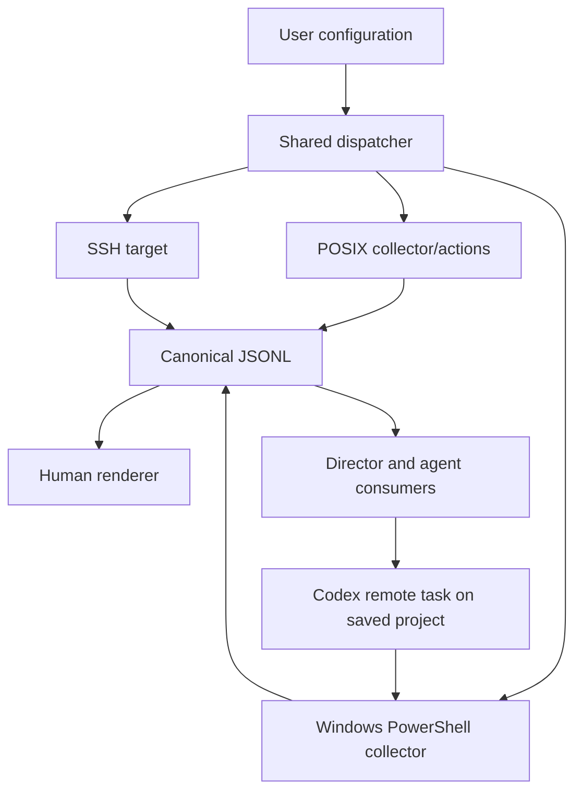
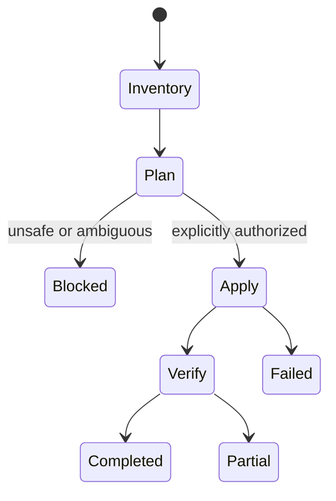

# feat: Implement Machine Utilities v1

## Goal Capsule

- **Objective:** Deliver a dual Codex and Claude plugin that inventories mixed-platform machines, renders human and agent-readable reports, plans guarded reconciliation, and prepares projects for Director dispatch.
- **Authority:** `docs/architecture.md` and the user's settled transport, configuration, ownership, and security decisions govern this plan.
- **Execution profile:** Build one shared dependency-light command surface, then expose focused skills that orchestrate it.
- **Stop condition:** Local behavior, schema, safety checks, skill validation, both plugin formats, and marketplace manifests pass.
- **Tail ownership:** Finish locally; do not commit, push, publish, or install without a separate request.

---

## Product Contract

### Summary

Machine Utilities owns fleet selection, structured inventory, desired-state comparison, project readiness, guarded reconciliation, remote-Mac operations, and SSH diagnosis.

### Requirements

**Inventory and configuration**

- R1. Load versioned JSON configuration from `MACHINE_UTILITIES_CONFIG` or the XDG user configuration path without embedding machine inventory in the plugin.
- R1a. Treat configuration values as data, never shell source; before mutation require a regular owner-controlled configuration file that is not group/world writable.
- R1b. The initiating controller is configuration authority for a run; operation records carry its configuration digest and remote workers receive only the resolved target, scope, and policy needed for that operation.
- R2. Emit deterministic JSONL with stable host/entity identifiers, evidence, confidence, timestamps, structured errors, SHA-256 fingerprints where meaningful, and usable partial results.
- R3. Render human, JSON, and JSONL views from captured records without recollecting.
- R4. Inventory host facts, packages, Codex/Claude runtimes, plugins, standalone skills and provenance, configured authentication artifacts, projects, startup definitions, and chezmoi state using manager-native evidence.

**Planning and reconciliation**

- R5. Provide read-only plans before any package, agent, project, authentication, or chezmoi mutation.
- R5a. Give each plan a stable ID and digest over targets, operations, and preconditions; apply must reference it, recapture preconditions, and stop with a replacement plan when they changed.
- R6. Require explicit apply scope, live identity verification, manager-native post-change verification, and no automatic destructive Git/package behavior.
- R7. Preserve manager ownership for plugins and skills; compare installations by logical capability without silently converting or vendoring them.
- R8. Clone missing configured projects only after path and remote resolution; update existing clean tracked branches by fast-forward only and stop on ambiguous or unsafe Git states.

**Transport and agent operation**

- R9. Support local and SSH execution with Bash 3.2-compatible orchestration, plus a native PowerShell collector that emits the same semantic JSONL on Windows.
- R10. Use the registered Windows Codex Desktop remote-control host directly through visible task creation; never require or silently fall back through WSL.
- R11. Keep Codex remote task lifecycle logic in skill instructions rather than imitating Desktop APIs in Bash.
- R12. Return operation records carrying run, host, scope, phase, status, and task correlation so Director can distinguish queued, running, partial, blocked, failed, and completed work.
- R12a. Bound record and string sizes and treat all collected fields as inert untrusted data; never execute or follow inventory-provided instructions, commands, paths, or URLs without independent configuration and live validation.

**Security and parity**

- R13. Never emit secret values; inventory credential metadata, fingerprints, configured distribution strategy, and native health only.
- R14. Treat credential movement and mutations as separately authorized actions, preserving each remote task's native approval path.
- R14a. Install credentials through private same-directory temporary files, reject links and ownership mismatches, replace atomically, clean up on every exit, and restore the prior file when native verification fails.
- R15. Provide semantic Codex/Claude parity for local and SSH workflows; report unsupported transport explicitly where Claude lacks Codex Desktop remote control.

### Scope Boundaries

- Human-only: Desktop remote-control enrollment, saved-project registration where no supported API exists, OAuth/device login, OS permission dialogs, and approval decisions.
- Deferred: a daemon, central database, generic workflow DSL, automated saved-project registration, task leases, and experimental unsandboxed remote execution.
- Generated reports and caches remain local artifacts and are not committed.
- Snapshot files default to private atomic writes, reject symlink destinations, and remain until the owner deletes them; Machine Utilities performs no automatic retention cleanup in v1.

---

## Planning Contract

### Key Technical Decisions

- KTD1. **One shared command surface** (session-settled: user-approved — chosen over independent per-skill implementations: inventory and reconciliation must stay consistent). Skills call the same plugin-owned scripts.
- KTD2. **JSON configuration and JSONL records** (session-settled: user-directed — chosen over TOML and prose-first output: Bash plus `jq` can validate and compose both without another runtime).
- KTD3. **Portable host code, harness-native orchestration** (session-settled: user-directed — chosen over a generic transport framework: Bash/PowerShell collect facts while skills use Codex task tools for Desktop remote control).
- KTD4. **Visible Windows Codex tasks in v1** (session-settled: user-directed — chosen over WSL routing: Windows already runs Codex Desktop and should be addressed directly).
- KTD5. **Plan before apply** (session-settled: user-approved — chosen over implicit reconciliation: package, Git, chezmoi, and credential changes have different risk boundaries).
- KTD6. **Git object identity for normal project comparison** (session-settled: user-approved — chosen over hashing every tracked file: HEAD/tree object IDs are authoritative and cheaper; deep SHA-256 remains explicit).

### High-Level Technical Design





### Assumptions

- `jq` is a declared fleet prerequisite on POSIX hosts; the controller probes it before collection and emits a structured unavailable record when it is missing.
- Windows task execution uses the running Codex Desktop instance; direct cross-host command execution is not required for v1.
- Remote task JSONL may be returned in the durable final task response only after a transport spike establishes a safe byte bound and byte-for-byte retrieval. Larger results require a durable artifact path reported by the task.
- Claude reports Windows Codex remote-control as unsupported rather than pretending transport parity.

---

## Output Structure

```text
plugins/machine-utilities/
├── config.example.json
├── scripts/
│   ├── machine-utilities
│   ├── collect-posix
│   ├── collect-windows.ps1
│   └── test-machine-utilities
└── skills/
    ├── fleet-inventory/
    ├── fleet-update/
    ├── fleet-agents/
    ├── fleet-auth/
    ├── fleet-chezmoi/
    ├── fleet-projects/
    ├── remote-mac/
    └── ssh-doctor/
```

---

## Implementation Units

### U1. Shared configuration and JSONL contract

- **Goal:** Establish the dispatcher, configuration discovery/validation, record envelope, operation records, rendering, validation, and comparison.
- **Requirements:** R1-R3, R12-R13; KTD1-KTD3.
- **Dependencies:** None.
- **Files:** `plugins/machine-utilities/scripts/machine-utilities`, `plugins/machine-utilities/scripts/test-machine-utilities`, `plugins/machine-utilities/config.example.json`.
- **Approach:** Keep stdout data-only, stderr diagnostic-only, deterministic ordering, explicit partial exit status, bounded task payloads, exact schema-version rejection, argv-safe configuration handling, and private atomic snapshot writes.
- **Execution note:** Begin with fixture-based contract failures for invalid configuration, unstable ordering, secret leakage, and partial results.
- **Test scenarios:**
  - Missing default configuration produces a clear configuration error without creating files.
  - An explicit valid fixture selects a host/group and emits schema-versioned records in stable order.
  - Human and aggregate JSON render from saved JSONL without invoking a collector.
  - Invalid schema versions, malformed records, and mismatched snapshot IDs fail validation.
  - Values marked secret in fixtures never appear in stdout or stderr.
- **Verification:** The self-check proves configuration precedence, validation, rendering, comparison, ordering, and exit-code behavior.

### U2. Portable single-host inventory

- **Goal:** Collect POSIX host, package, agent/capability, authentication metadata, project, startup-definition, and chezmoi records.
- **Requirements:** R2, R4, R7-R8, R13; KTD6.
- **Dependencies:** U1.
- **Files:** `plugins/machine-utilities/scripts/collect-posix`, `plugins/machine-utilities/scripts/machine-utilities`, `plugins/machine-utilities/scripts/test-machine-utilities`.
- **Approach:** Probe only installed native managers, inspect configured artifacts/projects, sanitize remotes, preserve provenance fields, use HEAD/tree IDs for Git, and emit typed unavailable/partial records instead of fabricated values. Treat every observed string as bounded untrusted data.
- **Test scenarios:**
  - A fixture environment with fake manager binaries produces normalized package and runtime records.
  - Missing optional managers produce capability absence without making the snapshot invalid.
  - A dirty, detached, wrong-origin, or missing project is classified distinctly.
  - Authentication records include path metadata and SHA-256 but not file contents.
  - Skill-lock provenance and plugin-cache birth-time inference retain evidence and confidence labels.
- **Verification:** Fixture collection is deterministic and a real local read-only smoke run validates successfully.

### U3. SSH and native Windows collection

- **Goal:** Execute the same inventory contract over SSH and from native Windows PowerShell without a WSL dependency.
- **Requirements:** R2, R4, R9-R10, R15; KTD3-KTD4.
- **Dependencies:** U1, U2 and the remote-result transport spike described below.
- **Files:** `plugins/machine-utilities/scripts/machine-utilities`, `plugins/machine-utilities/scripts/collect-windows.ps1`, `plugins/machine-utilities/scripts/test-machine-utilities`.
- **Approach:** Use explicit configured SSH aliases with batch/no-TTY options; make PowerShell emit compact UTF-8 JSONL directly; keep Codex Desktop task dispatch out of shell code.
- **Test scenarios:**
  - SSH target resolution rejects absent aliases and identity mismatches before collection.
  - Remote partial failure preserves valid records and returns partial status.
  - PowerShell fixture output normalizes hashes, timestamps, package records, and nulls identically to POSIX semantics.
  - No WSL path or implicit fallback is selected for a `codex-remote-control` machine.
- **Execution note:** Before treating final task messages as a result channel, send a representative bounded JSONL fixture through a real remote task and verify byte-for-byte retrieval, truncation behavior, and resume behavior. Select a durable artifact-path fallback if the bound is insufficient.
- **Verification:** Shell tests validate dispatch construction; PowerShell parser/tests run when `pwsh` is available and otherwise report a precise local validation limitation.

### U4. Guarded plans and applies

- **Goal:** Add minimal package, project, agent, auth, and chezmoi planning/apply commands using native managers and shared safety gates.
- **Requirements:** R5-R8, R13-R14; KTD5-KTD6.
- **Dependencies:** U1-U3.
- **Files:** `plugins/machine-utilities/scripts/machine-utilities`, `plugins/machine-utilities/scripts/collect-posix`, `plugins/machine-utilities/scripts/collect-windows.ps1`, `plugins/machine-utilities/scripts/test-machine-utilities`.
- **Approach:** Default every domain to plan; require explicit apply, exact targets, and a referenced plan ID/digest; recapture and compare plan preconditions before mutation. Validate configuration ownership/mode without evaluating its values; delegate package/chezmoi work to native commands; clone only absent projects and fast-forward only safe repositories. Install configured portable credentials through private same-directory temporary files, reject links and ownership mismatches, replace atomically, clean up on every exit, run native verification, and restore the prior file on verification failure.
- **Test scenarios:**
  - Omitting `--apply` never invokes a mutating fixture command.
  - Apply refuses identity mismatch, dirty/diverged Git, ambiguous development root, and an unconfigured credential strategy.
  - Apply refuses a missing/mismatched plan digest or changed package, Git, credential, or target precondition and emits a replacement plan.
  - Apply refuses a non-regular, wrong-owner, group/world-writable, or symlinked configuration file.
  - Package cleanup, autoremove, distribution upgrade, and broad credential copying remain separate explicit choices.
  - Independent host failure does not broaden or mutate another target.
  - Successful fixture apply is followed by native verification and a new inventory record.
  - Credential fixture apply leaves no temporary file and restores the prior file when verification fails.
- **Verification:** Fake managers record exact argv so the self-check proves planning and safety gates without mutating the workstation.

### U5. Dual-agent fleet skills

- **Goal:** Expose `fleet-inventory`, `fleet-update`, `fleet-agents`, `fleet-auth`, `fleet-chezmoi`, and `fleet-projects` as concise Codex/Claude skills over the shared commands.
- **Requirements:** R3-R15; KTD1-KTD5.
- **Dependencies:** U1-U4.
- **Files:** `plugins/machine-utilities/skills/*/SKILL.md`, `plugins/machine-utilities/skills/*/agents/openai.yaml`, `plugins/machine-utilities/.claude-plugin/plugin.json`, `plugins/machine-utilities/skills/README.md`.
- **Approach:** Put deterministic collection/action behavior in scripts and judgment/orchestration in skills. Codex instructions use controller-resolved configuration, saved-project discovery, task creation, bounded waiting, result validation, and handoff requirements. Claude uses local/SSH execution and reports unsupported Windows transport.
- **Test scenarios:**
  - Every skill validates and points only to plugin-owned resources.
  - Inventory and planning requests remain read-only by default.
  - Windows Codex flow resolves a saved project, handles queued setup before a real task ID, waits for structured completion, and reports human-gated enrollment/registration.
  - Approval, disconnect, needs-attention, invalid JSONL, and missing matching handoff project surface as blocked/partial rather than triggering broader retries.
- **Verification:** Skill validators, manifest validation, and a forward-test agent can follow representative inventory and project-readiness prompts without hidden context.

### U6. Integration and documentation

- **Goal:** Leave a self-contained, validated plugin and accurate marketplace metadata.
- **Requirements:** R1-R15.
- **Dependencies:** U1-U5.
- **Files:** `README.md`, `docs/architecture.md`, `plugins/machine-utilities/.codex-plugin/plugin.json`, `plugins/machine-utilities/.claude-plugin/plugin.json`, and the separate marketplace repository manifests and README.
- **Approach:** Document configuration and invocation, keep architecture aligned with implemented behavior, list unsupported/deferred surfaces, and validate both harness formats without installing or publishing.
- **Test scenarios:**
  - All JSON manifests parse and version coupling stays aligned.
  - Codex and Claude plugin validators accept the final tree.
  - Shell syntax, self-checks, PowerShell checks when available, and whitespace validation pass.
  - A local end-to-end inventory snapshot validates and renders human output.
- **Verification:** The repository's complete local validation command set passes with any unavailable host-specific checks identified explicitly.

---

## Verification Contract

| Gate | Applies to | Done signal |
|---|---|---|
| Shell syntax and self-check | U1-U4 | All Bash scripts parse and fixture assertions pass |
| PowerShell parser/fixture check | U3-U4 | Passes when `pwsh` is present; absence is explicitly reported |
| Real local read-only smoke | U2, U6 | JSONL validates and renders without exposing credential values |
| Remote result transport spike | U3, U5 | Representative bounded JSONL returns byte-for-byte or a durable artifact fallback is proven |
| Windows Codex Desktop end to end | U3, U5 | Visible remote task runs the PowerShell collector and returns validated JSONL, including blocked/needs-attention handling |
| Skill validation | U5 | All eight skill folders pass the skill validator |
| Codex plugin validation | U5-U6 | Plugin creator validator passes |
| Claude plugin validation | U5-U6 | Strict Claude validation passes |
| Manifest and diff hygiene | U6 | JSON parsing and `git diff --check` pass |
| Forward test | U5 | Independent agent correctly follows inventory/project workflow without mutations |

---

## Definition of Done

- The shared dispatcher supports configuration validation, local collection, rendering, validation, comparison, plan sealing, and precondition verification.
- POSIX and Windows collectors share the documented JSONL semantics; Windows never requires WSL.
- The eight skills are registered in both plugin manifests; fleet skills use the shared scripts.
- Project, capability/provenance, authentication, package, startup, and chezmoi records are present with safe evidence labeling.
- Mutations are impossible without explicit scope and stop on identity, ambiguity, approval, or unsafe-state failures.
- Director-facing Codex task lifecycle and saved-project rules are operationally documented in the relevant skills.
- All local gates pass and the enrolled Windows Codex Desktop workflow is verified end to end. If access is unavailable, Windows support remains explicitly unverified and requires the user's documented waiver; no commit, push, installation, remote mutation, or credential copying is performed.
