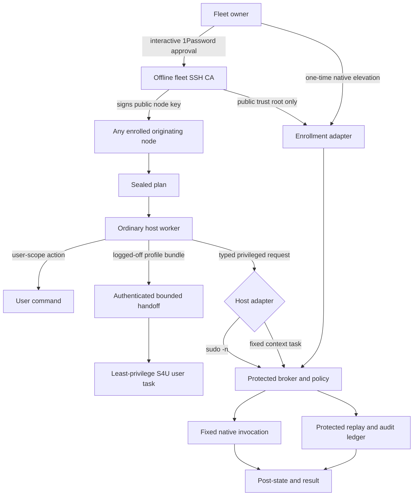
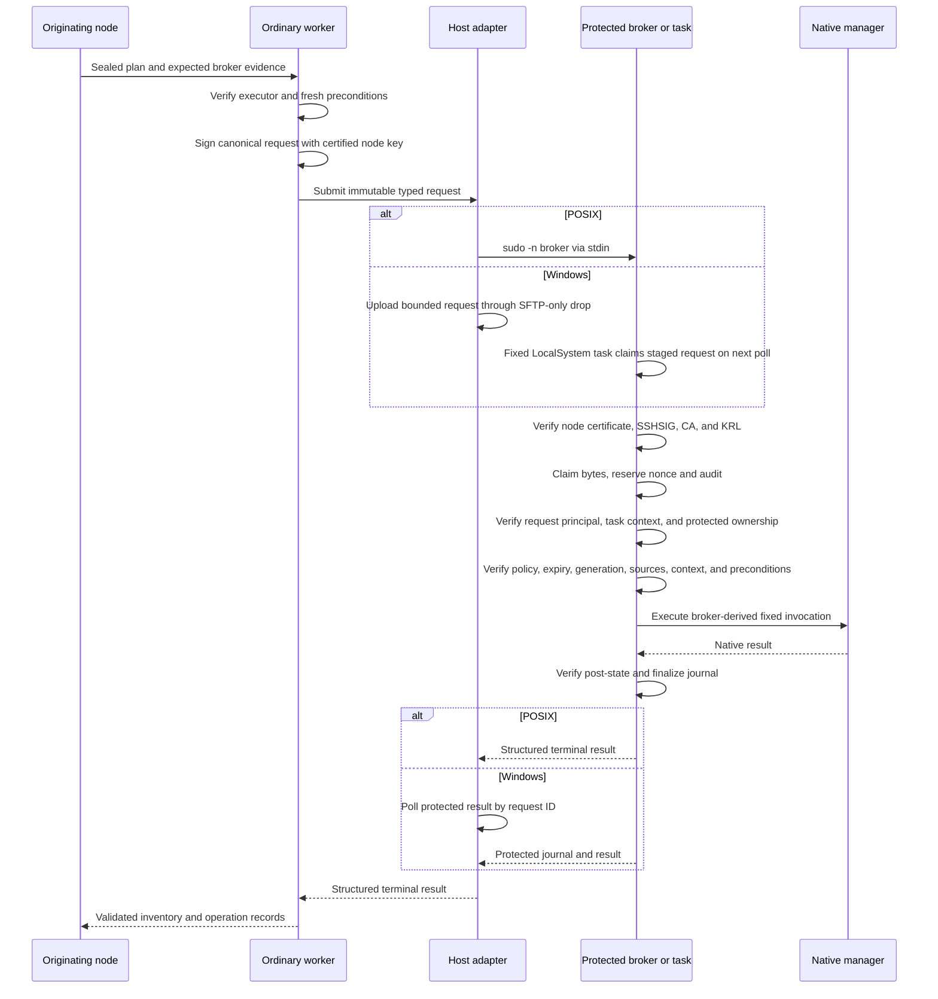
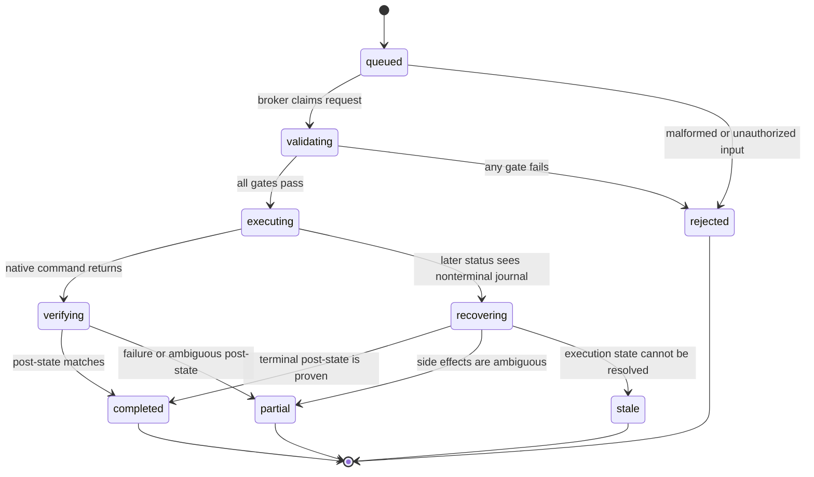
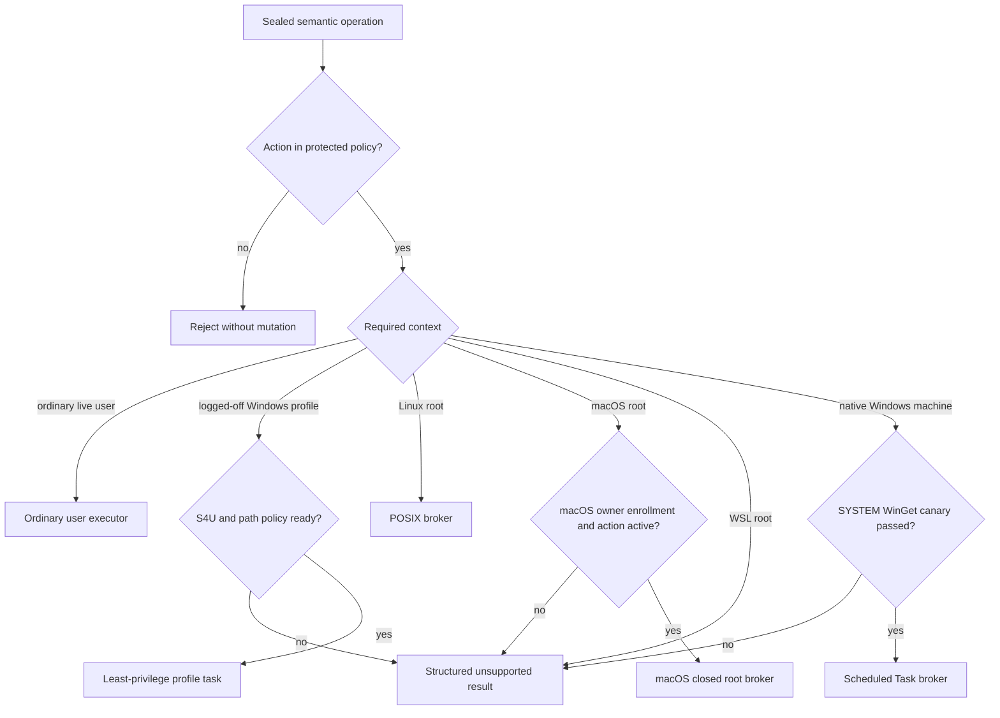
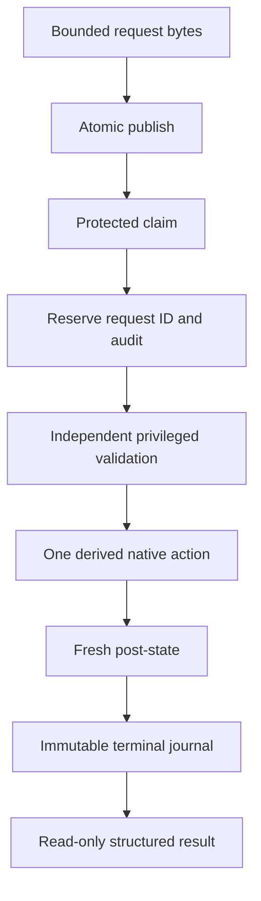

# Unattended Fleet Privilege Brokers - Plan

## Goal Capsule

- **Objective:** Let enrolled Linux, macOS, and native Windows hosts execute approved privileged fleet operations and reconcile approved user-profile configuration/skills with no interactive console user logged in, while keeping every action bound to one human-approved OS execution context. macOS also retains login-window SSH for ordinary user reconciliation; WSL v1 exposes unprivileged inventory only.
- **Authority:** The Product Contract defines allowed behavior. The protected host policy authorizes privileged action IDs. The sealed plan selects an authorized action but does not grant privilege.
- **Execution profile:** Security-sensitive, cross-platform work with characterization coverage before mutation paths change and native canaries before privileged rollout.
- **Stop conditions:** Stop if an implementation elevates user-writable code, accepts arbitrary commands, stores an administrator credential, exposes a remote Administrator shell, weakens global UAC or sudo policy, silently changes an action's execution context, cannot reserve its audit record, or cannot prove transport and broker identity independently.
- **Tail ownership:** The change is complete only after fixture coverage, native platform canaries, release-integrity checks, and enrollment/revocation documentation pass.

---

## Product Contract

### Summary

Machine Utilities will add an enrolled privilege broker for each host security boundary. The existing user-owned plugin remains the ordinary executor and may originate work from any enrolled fleet node. A separate root- or Administrator-owned broker enforces a small semantic action catalog, produces protected audit evidence, and runs only after the existing sealed-plan and fresh-precondition gates pass.

macOS and Linux use their existing machine SSH service to create an on-demand user session. Linux calls a narrow `sudoers` broker for approved APT actions. macOS has an owner-enrolled root broker, disabled by default, with exactly `macos.install-signed-pkg.v1` and `macos.apply-system-setting.v1`; it never grants root Homebrew, arbitrary `sudo`, arbitrary installer scripts, or arbitrary plist paths. `macos.install-signed-pkg.v1` is script-free by default; an owner may instead seal one exact Apple-signed package as `sealed-cask-payload-v1`, which the broker invokes only through fixed `installer -pkg … -target /`. That root phase never runs Homebrew and never claims user-owned Caskroom state changed. Native Windows adds a key-only, SFTP-only OpenSSH drop lane, an ACL-restricted recurring LocalSystem task for protected machine-wide WinGet actions, and a separate non-elevated S4U task for locally staged user-profile reconciliation. The S4U task stores no password and has no network access: an originating node sends a signed bounded bundle containing rendered config, standalone skills, or local marketplace snapshots, and the task applies only protected path/manager records as the enrolled user. No synced content is executed as SYSTEM. WSL root mutation remains unsupported.

### Problem Frame

The executor already accepts exact `sudo -n apt-get` argument shapes, but the repository neither provisions nor verifies the policy that makes those calls passwordless. Granting `NOPASSWD` to the current plugin would be unsafe because installed plugin files are intentionally owned by the invoking user. The sealed plan uses an unkeyed digest for integrity and confirmation; it is not root authorization.

Windows has the same trust-boundary problem with different platform mechanics. Windows `sudo` and `RunAs` still require UAC consent. Elevating the whole PowerShell worker would also run user-profile actions in the wrong security context. The current Codex Desktop transport is tied to a visible user session, so elevation alone does not make a Windows host reachable after logout.

### Actors

- A1. **Fleet owner:** Performs enrollment, policy expansion, broker upgrade, and revocation through the native password or UAC boundary.
- A2. **Originating fleet node:** Any enrolled machine may build and seal plans, verify broker readiness, submit approved actions, and validate results using its own certified noninteractive node identity. There is no permanent controller role and no shared fleet private key.
- A3. **Enrolled request principal:** May request only the action-context pairs granted to its UID or SID; processes running as that principal share that authority.
- A4. **Privilege broker:** Revalidates the request and policy at the privileged boundary, executes one typed native action at a time, and records authoritative evidence.
- A5. **Native execution principal:** Runs one fixed broker context as Linux root or Windows LocalSystem; it never selects its own context.
- A6. **Enrolled profile principal:** The configured ordinary user account whose non-elevated POSIX session or Windows S4U task applies bounded file-backed settings, standalone skills, and manager-native operations from a locally staged bundle.

### Requirements

**Authorization boundary**

- R1. Enrollment, broker upgrade, policy expansion, and revocation require one native human elevation on each host security boundary.
- R2. Routine privileged execution must not prompt for a password or UAC consent after enrollment.
- R3. The privileged entrypoint and policy must be root- or Administrator-owned, non-user-writable, and independent of plugin caches, source checkouts, plans, and user configuration.
- R4. The broker must dispatch through a closed, versioned action catalog installed with the protected broker. Each action ID maps to one fixed handler, exact parameter schema, protected policy constraints, and a broker-derived native invocation: either absolute executable argv or one exact cmdlet with named parameters and attested dependencies. Unknown action versions, fields, values, contexts, or policy constraints fail closed. The packaged default list and user configuration are planning inputs only, never runtime authorization. The request must never carry shell text, PowerShell text, executable paths, arbitrary argv, cmdlet names, environment overrides, or a working directory. The catalog must never contain a generic `run-command`, `run-script`, `install-package`, package-manager passthrough, or command-template action; installs and upgrades require package-manager-specific compiled handlers.
- R5. Machine Utilities must never store, transmit, log, or derive a reusable administrator password, token, credential, or fleet-wide private key. Routine fleet SSH must not depend on an interactive SSH agent, desktop unlock, biometric approval, or a 1Password service-account token. Each enrolled node's automation private key stays only on that node, outside repositories, plugin caches, synced folders, plans, logs, and peer machines, with owner-only mode or ACL and full-disk encryption as the at-rest boundary.
- R6. Each enrolled machine gets one unique Ed25519 node key per fleet security domain and an SSH user certificate signed by one offline fleet CA. Every target trusts only the CA public key plus protected principal and forced-endpoint policy; it does not maintain pairwise caller keys. Node private keys and the CA private key are never distributed. The certificate binds fleet domain, stable node ID, key fingerprint, serial, validity, a unique signing principal `<node-id>@<fleet-domain>`, endpoint login principals, and optional source addresses while clearing shell, PTY, forwarding, tunneling, agent-forwarding, user-rc, and X11 capabilities. The CA private key remains owner-controlled in a 1Password identity and vault membership unavailable to the ordinary OS account, or in an offline or hardware-backed signer; `agent.toml` exclusion alone is not a security boundary. Signing occurs only from a fresh separate owner-controlled OS signing account that is the only local account signed into that CA-holding 1Password identity, or from the offline/hardware signer, with strict per-application-and-terminal approval, no `approve for all applications`, no preexisting CA authorization, and no untrusted descendants of the pinned signing helper. A native canary must prove the ordinary account cannot enumerate, export, or offer the CA even after replacing its own `agent.toml`. The ceremony displays a canonical certificate manifest before signing, independently verifies the emitted certificate against that manifest, terminates the helper and terminal session, and locks 1Password immediately. 1Password approval may be reusable within the authorized process/session and is not claimed as per-signature consent; a fleet requiring hardware-enforced confirmation for every certificate must use a separate offline or hardware-backed CA signer. Routine SSH uses the local node key and certificate without 1Password. Enrollment also returns the target host-key fingerprint read locally from protected host configuration; the originating node pins it only after owner confirmation through the elevated local console or an already trusted interactive session. Network `ssh-keyscan` output may collect a candidate but is never sufficient enrollment authority.

**Cross-platform elevation**

- R7. Linux must invoke a protected broker through a narrow `NOPASSWD:NOSETENV` sudoers rule and `sudo -n`; package managers and plugin scripts must not appear directly in the grant. macOS must use an owner-enrolled root broker that remains disabled until a human activates one of its two closed actions: `macos.install-signed-pkg.v1` or `macos.apply-system-setting.v1`. It must not grant root Homebrew, arbitrary `sudo`, arbitrary installer scripts, or arbitrary plist paths. The only scripted package exception is a human-enrolled `sealed-cask-payload-v1` exact Apple-signed package, passed only to the fixed installer invocation. WSL root actions are outside the v1 containment boundary.
- R8. Native Windows must use two fixed Administrator-owned Scheduled Tasks: one recurring `TASK_LOGON_SERVICE_ACCOUNT` LocalSystem broker for machine-wide WinGet and protected request routing, and one on-demand `TASK_LOGON_S4U` task at least privilege for the configured ordinary user to inventory/apply bounded profile state. Their actions, principals, logon types, run levels, triggers, working directories, dependency identities, and complete security descriptors are verified before every submission. Each descriptor has protected SYSTEM/Administrators owner and group, an Administrator-only DACL, and no automatic principal ACE; target users retain no owner, change-descriptor, re-register, delete, run, or stop right. Neither task stores a password. The S4U task has no network or encrypted-file access and is supported only for a non-built-in-Administrator account on a UAC-enabled host whose observed token is medium-or-lower integrity, non-elevated, lacks an enabled Administrators SID and dangerous privileges, and fails protected-write canaries; task XML `RunLevel` alone is never accepted as proof.
- R9. Windows `sudo`, UAC suppression, password-bearing scheduled tasks, interactive-token fallback, and a continuously running custom privileged service must not be runtime elevation paths.
- R10. WSL must expose unprivileged inventory only and return `unsupported_security_boundary` for root actions. A Windows user that owns a distribution can launch it as root and therefore can bypass an in-distribution broker; Windows and WSL must never present their separation as containment from that owner.
- R11. User-scope operations must remain at the ordinary user's privilege level: through the SSH-created user session on POSIX or the non-elevated S4U task on logged-off Windows. LocalSystem may verify and route a profile bundle but must never execute its content, run user package managers, impersonate profile state, or retry a failed user operation with privilege.

**Request and execution safety**

- R12. A protected broker-routed machine or profile request must bind the host, enrolled UID or SID, originating node identity, fleet CA generation, node certificate fingerprint and serial, plan and request IDs, action ID, broker and policy identity, precondition digest, creation time, expiry, and exact executor evidence. Windows request TTL must be at least two attested poll intervals plus a bounded enrollment-measured clock-skew allowance; sealing rejects shorter or excessively long TTLs.
- R13. The originating node must produce a detached OpenSSH signature over the exact canonical request bytes using its certified node key and the fixed `machine-utilities-request` namespace. The broker must call the attested absolute system `ssh-keygen -Y verify` with the exact unique signing principal `<node-id>@<fleet-domain>`, the protected fleet-CA allowed-signers record, KRL, and `-O print-pubkey`; it must parse the returned certificate with the attested absolute system `ssh-keygen -Lf` and compare CA, key ID, serial, fingerprint, validity, signing principal, endpoint principals, and cleared extensions to the protected/requested identity. Verification precedes atomic claim, replay reservation, or any native side effect. This binds a Windows SFTP upload to one node even though all uploads use the same request SID; verifier-supplied identity alone is never treated as identity extraction.
- R14. The broker must revalidate the node certificate fields extracted under R13, signature namespace and exact signing identity, CA generation, KRL, caller UID or SID, protected ownership or ACLs, policy coverage, broker identity, request expiry, replay state, fresh preconditions, and the fixed native invocation it derives. Signature validation uses only attested absolute system OpenSSH capabilities; a host lacking `ssh-keygen -Y verify`, `-O print-pubkey`, or parseable `ssh-keygen -Lf` output is unsupported rather than accepting an unsigned or merely claimed node identity.
- R15. Protected broker-routed machine or profile work must serialize per host, preserve plan operation order, stop on the first failed operation, and never retry automatically after disconnect, reboot, timeout, or an ambiguous native result. Broker/helper processes must have broker-owned process containment and durable liveness identity; package-manager and S4U task operations must be awaited to an independently verified terminal result before journal completion. Services, drivers, scheduled tasks, Windows Installer service work, and other package-created machine effects are authorized package post-state, not falsely claimed process descendants. No generation reference is released or normal drain completes while the broker-owned process or awaited native operation remains live.
- R16. Results must expose `queued`, `validating`, `executing`, `recovering`, `verifying`, `completed`, `partial`, `rejected`, and `stale` states with a protected journal that can be queried by plan and request ID.
- R17. The broker must fail closed if it cannot reserve replay state, write audit evidence, verify post-state, or return an authoritative terminal or stale record.

**Lifecycle and visibility**

- R18. Inventory must report broker enrollment, platform adapter, request principal, execution principals, broker version and digest, policy version and digest, allowed action-context pairs and constraint digests, fleet CA fingerprint and generation, local node ID, node-key fingerprint, certificate serial and validity, pinned host-key fingerprint, transport readiness, task or sudoers readiness, drift, active request, and last terminal result without elevation. It never returns private key bytes or secret paths in remote results.
- R19. Enrollment and upgrades must stage and validate the complete protected installation before atomic activation, preserve the prior known-good enrollment until verification succeeds, and roll back on failure. Node-key renewal uses generate, interactively certify, local canary, switch, then erase-old ordering; because targets trust the fleet CA, ordinary node renewal changes no target authorization. The old key and certificate remain usable until the replacement succeeds against representative POSIX and Windows forced endpoints. CA trust changes and revocation-list installation are human-authorized protected operations and are never requestable through the ordinary action broker. A client release must remain compatible with the current and immediately previous protected broker protocol for readiness, result retrieval, revocation, and action-context pairs both versions understand; broker upgrade is required only when a requested action cannot be represented or safely authorized by the enrolled version.
- R20. Normal broker revocation must enter a protected draining epoch, reject new submissions while preserving status and result reads, let active broker-owned processes and awaited native operations reach a journaled terminal state, then remove CA trust, principal mappings, transport rights, and broker grants and prove no runnable broker remains. Emergency node revocation installs an owner-generated KRL that rejects the affected key ID, serial, or fingerprint before other cleanup and uses an independent interactive administrator, console, RDP, or other owner-controlled break-glass path; the compromised node cannot authorize its replacement or revocation-state changes. Emergency process revocation is the only path allowed to terminate contained broker/helper processes and may produce `partial` or `stale`; it cannot promise reversal of package-created services, drivers, tasks, or Windows Installer service work.
- R21. The v1 privileged/routed catalog must contain only `apt.update-metadata.v1`, `apt.install-package-version.v1`, `apt.upgrade-package.v1`, `apt.autoremove.v1`, `macos.install-signed-pkg.v1`, `macos.apply-system-setting.v1`, `winget.inventory-machine.v1`, `winget.install-machine-package.v1`, `winget.upgrade-machine-package.v1`, `profile.inventory-managed-state.v1`, and `profile.apply-managed-bundle.v1`. The shipped default enables APT metadata refresh and fixed no-parameter Windows machine inventory; macOS actions, installs, upgrades, autoremove, and both profile actions remain disabled until a human activates host-specific constraints. A macOS package policy authorizes one signed package identity, exact protected package path/digest, and fixed receipt/post-state. Its default `script-free` mode rejects package scripts; `sealed-cask-payload-v1` is the sole exception and binds every script and operation through that exact Apple-signed package hash, still launched only through the fixed installer invocation. It does not update or attest Homebrew Caskroom state. A system-setting policy authorizes only a repository-defined setting key and fixed value with no arbitrary plist path. Root Homebrew, arbitrary `sudo`, arbitrary installer scripts, and arbitrary plist paths are not policy values. APT policies retain exact-install and bounded signed-repository-channel semantics. A WinGet policy authorizes an exact package ID, protected root source identity, machine scope, architecture/locale selection, allowed installer-type set, exact version or bounded monotonic version/major range, and the sole v1 dependency authority `source-delegated-all`. Activating that token expressly permits WinGet to select newly installed package dependencies from the root package's protected catalog, accept already-installed packages as satisfying dependency constraints through WinGet's installed source, and enable Windows Features declared by the selected root installer. A profile policy authorizes one target SID/profile root and canonical managed-entry records that bind each exact relative destination to one compiled handler kind and logical artifact identity, plus protected local marketplace/plugin identities, deletion behavior, and entry/byte caps. Adding an action, package, source, destination, handler association, artifact identity, marketplace/plugin, or widening a channel is a human-elevated protected-policy generation change; runtime requests select only active protected tokens.
- R22. Unsupported or unenrolled actions must return structured evidence and perform no mutation; there is no fallback to broad sudo, SYSTEM, UAC suppression, WSL, or an interactive command shell.
- R23. Local, POSIX SSH, `windows-sftp`, Codex remote-control, Codex skill, and Claude skill surfaces must expose the same broker readiness, plan ID, request state, and terminal result semantics while preserving their documented transport and execution-context limitations. Automation SSH invocations must bypass ordinary user SSH configuration and control sockets, use explicit host, port, user, private-key, certificate, and dedicated pinned-known-hosts paths, and set `IdentitiesOnly=yes`, `IdentityAgent=none`, `BatchMode=yes`, strict host-key checking, `ControlMaster=no`, `ControlPath=none`, `ClearAllForwardings=yes`, and `PermitLocalCommand=no`. They neither offer nor prompt for interactive 1Password-agent keys and cannot reuse an already-authenticated interactive session.
- R24. The first elevated enrollment process must be an OS-protected bootstrap/verifier, never a script, command text, or executable supplied by the candidate release tree or user-owned CLI. The owner maintains a small fixed bootstrap invocation and its digest in an owner-controlled enrollment record distributed independently of the repository/release; alternatively, an already-installed OS/package-managed verifier may supply it. Before elevation the owner compares and inspects that exact invocation. On POSIX the fixed inline invocation uses only the system shell, OpenSSH verifier, hashing, descriptor-safe copy, ownership, and exec primitives plus a separately confirmed release-signing public key/allowed-signers record. On Windows the fixed invocation uses only system PowerShell/OS trust and copy primitives plus a pinned Authenticode publisher certificate identity. Candidate tooling may display expected values but cannot supply or modify the authoritative bootstrap command or trust anchor. Before executing any candidate byte, the bootstrap authenticates the release, copies verified bytes through already-open non-link handles into protected staging, rehashes the protected copy, and executes only that copy. Release signature, candidate digest, protected-copy digest, publisher/signing identity, and activated generation digest must agree. If the platform cannot provide this minimal independently authenticated bootstrap, enrollment stops. Post-enrollment containment still does not cover an OS account already compromised before the human ceremony begins.
- R25. Privileged package requests must bind protected package-source identity and trust configuration so repository, keyring, source, scope, package ID, or channel drift fails preflight. APT requires signed repository metadata rooted in the protected keyring. Windows uses only the pinned, signed official `Microsoft.WinGet.Client` PowerShell module (currently 1.29.280) under LocalSystem and protected WinGet state; `winget.exe`, generic configuration/DSC, and request-controlled cmdlet dispatch are unsupported in SYSTEM context. Before invoking the module, the broker sets a dedicated protected state identifier whose remote package lookup contains exactly one policy-authorized catalog and whose effective `installBehavior.skipDependencies` setting is false or absent, imports only the locked module manifest, exact-matches one package/version, obtains one applicable installer matching machine scope, architecture, locale, and installer type, then installs or upgrades that same resolved version with fixed silent parameters and no hash mismatch, force, override, custom arguments, manifests, headers, proxies, locations, or interactive behavior. The broker re-attests the protected module, setting, and source state before every invocation; setting drift is unsupported rather than silently skipping dependencies. WinGet's manifest installer-hash enforcement must pass an owned disposable-source corrupt-hash canary. Requests cannot supply dependency identities, modes, sources, or switches, and ordinary enrolled-node credentials must have no catalog publishing or rewrite authority; a source that cannot prove that separation is unsupported. The provider selects newly installed package dependencies from the resolved root package's protected catalog, but its composite dependency view may treat already-installed packages as satisfying constraints regardless of their original source. Windows Feature processing applies only to features declared by the selected root installer, not features declared transitively by dependency-package installers. The public module API exposes neither the complete dependency closure nor dependency provenance, so activating a WinGet token delegates this SYSTEM authority to the attested provider/source and results report the boundary without claiming independent closure verification. A feature result requiring reboot is recorded conservatively as `partial` with `reason=reboot_required`; the broker never replays automatically.
- R26. Each host must admit at most one queued or active protected broker-routed machine or profile request, reserve capacity for audit and revocation, and cap resolved-result retention without deleting unresolved evidence. Consumed request-ID tombstones persist across reboot, rollback, and generation changes until request expiry plus the maximum clock-skew allowance; compaction is atomic and cannot remove an unexpired tombstone.

**Logged-off availability and context binding**

- R27. Readiness must report `transport_ready`, `node_identity_ready`, `broker_ready`, and `action_context_ready` independently; a ready broker does not imply that the originating node can reach it or that every action is valid without a console session.
- R28. macOS and Linux must support no-console-session submission through the existing SSH service. A root-owned CA trust file and authorized-principals mapping must accept only the fleet certificate principal and force the protected dispatcher while disabling shell choice, PTY, forwarding, tunneling, agent forwarding, user rc, and environment. Linux's dispatcher invokes its on-demand POSIX broker. macOS dispatches ordinary repository-defined user workflow verbs or, only after owner enrollment and local interactive activation, one of its two protected action IDs; its SSH transport cannot perform enrollment, activation, or elevation. The interactive 1Password-backed key and ordinary SSH behavior remain separate. No additional resident root daemon is required.
- R29. Native Windows no-console-session submission must use an automatic OpenSSH Server service, CA-signed public-key authentication, a dedicated non-administrator request SID whose name matches a certificate principal, a protected CA trust/KRL configuration, and a chrooted `ForceCommand internal-sftp` lane. Only SYSTEM and Administrators may modify CA trust, the KRL, account principals, or SSH policy. The request SID owns only four preallocated slot files—request, detached signature, optional bounded payload, and commit marker—on a volume with an enforced per-SID hard NTFS quota; Administrator-owned directories deny create/delete/rename/list, and explicit OWNER RIGHTS ACEs deny the owner implicit DACL/owner changes while granting only bounded write-data on those files. The account may read only sanitized results and receives no shell, exec command, SCP, non-SFTP subsystem, Administrator membership, task run or modification rights, or access to protected broker state. Enrollment proves effective ownership, OWNER RIGHTS behavior, quota accounting, file-extension denial, disk-full behavior, and recovery before enabling transport. The LocalSystem broker independently verifies the signed request and payload digest against the fleet CA and KRL. If certificate authentication, request-signature verification, CA/KRL identity, source restriction, ACL, quota, ownership, or effective SFTP-only restriction cannot be proven, the transport is unsupported.
- R30. `winget.install-machine-package.v1` and `winget.upgrade-machine-package.v1` bind immutable `windows-system-v1`, are LocalSystem only, disabled by default, and accept only protected tokens described by R21/R25. The enrolled generation pins the signed `Microsoft.WinGet.Client` module manifest/file set and required WinGet/App Installer deployment identities by protected path/version/digest and owns the SYSTEM-context state identifier and source configuration. Any user-writable module/source/settings/cache/temp path, ambiguous root-source result, package/scope/version/applicable-installer mismatch, provider version/digest not covered by the dependency-source canaries, unsupported installer type, interactive agreement/authentication requirement, request-supplied dependency control, or inability to prove native hash rejection leaves the action unsupported. The broker cannot observe or reject an already-installed package solely because it originally came from another source; that is an explicit `source-delegated-all` residual. Root-installer Windows Feature dependencies are provider-managed OS capabilities, not package-catalog records. Store packages requiring interactive Entra licensing and user-scope packages are outside this context; ordinary interactive user WinGet remains separate.
- R31. Logout, lock, reboot, transport failure, or context-canary failure must return `transport_unavailable` or `unsupported_context` as applicable. Machine actions never fall back to S4U, an interactive user, WSL, or another account; profile actions never fall back to LocalSystem or an interactive token.
- R32. Every request and result must bind the transport, fleet CA fingerprint and generation, originating node ID, node-key fingerprint, certificate serial, pinned host-key fingerprint, request principal, required execution context, observed execution principal, console-session state, platform boundary, enrollment epoch, policy digest, and context-canary digest.
- R33. WSL root execution must report `unsupported_security_boundary` in v1 even while the distribution is reachable. A later plan may enable it only behind a separate administrative boundary that prevents the distribution-owning Windows identity from launching or modifying the distribution as root; logged-off identity creation alone is insufficient.
- R34. The no-console-session guarantee applies only while the host is booted, unlocked past any preboot disk-encryption boundary, awake or wakeable under existing owner policy, and reachable from the originating node. Power-on, FileVault or BitLocker preboot unlock, and wake-policy management are outside this version.
- R35. Windows inventory is a fixed read-only LocalSystem WinGet-provider action that reports installed/candidate package ID, source, version, scope, architecture, and installer-type evidence. It cannot authorize mutation by itself. A machine request selects one active protected WinGet token, and the broker re-resolves exact source/package/scope and fresh pre-state immediately before provider invocation; ordinary collector output may render but not recreate authority.
- R36. Every Linux APT handler must use one protected, generation-bound effective APT configuration. It must prevent loading unapproved `apt.conf` fragments, bind source, keyring, preferences, architecture, method, compressor, `dpkg`, and helper identities, clear inherited proxy and APT environment, and reject every effective `Pre-Invoke`, `Post-Invoke`, `Pre-Install-Pkgs`, proxy-login, custom method/compressor, or other command hook before APT starts. A host that cannot prove the complete effective configuration is unsupported; the enabled-by-default metadata refresh is not exempt.
- R37. `profile.inventory-managed-state.v1` runs through the non-elevated S4U worker with no payload and returns only presence, digest, and manager identity for the active protected entry map. A profile apply bundle must contain one canonical manifest, bounded uncompressed length-prefixed payload container, detached node signature, target policy token, and expected live presence/digest or manager identity for every entry. The signature covers the exact manifest plus payload digest. After authentication and replay reservation, LocalSystem must copy from the exclusively held ingress handle into a fresh non-inheriting SYSTEM-owned handoff file, flush and reverify length/digest, grant the target SID read-only access, and atomically publish the handoff generation; it must never rename/hard-link the request-owned ingress file, preserve its owner/DACL, interpret the container, parse file contents, import configuration, or execute any payload byte. Only then may it close/reset ingress. The non-elevated profile worker independently verifies manifest/digest/token and fresh expected live state before applying atomically; any mismatch returns current digests for a new reconciliation cycle and changes nothing.
- R38. The Windows profile task must run only as the enrolled target SID with `TASK_LOGON_S4U`, least run level, no stored credential, no network, no encrypted-file dependency, no interactive-token fallback, a protected fixed action, and a DACL that lets only SYSTEM/Administrators modify or invoke it. It may write only non-reparse regular files beneath the locally resolved target profile and only at active protected relative paths, using handle-based no-follow ancestor traversal retained through atomic replacement. It must reject absolute/device/UNC paths, alternate data streams, reserved names, traversal, case collisions, links, unsafe or changed ancestors, ownership changes, ACL payloads, startup/task/service locations, SSH authorization/configuration, credential/session stores, Codex internal databases, and plugin cache writes.
- R39. Managed profile bundles may contain rendered chezmoi-owned files, allowlisted Codex/Claude settings, a portable projection of machine-utilities configuration, standalone skill trees, and a local Codex marketplace snapshot plus exact desired `plugin@marketplace` record. Node ID, node-key/certificate/known-hosts paths, endpoint receipts, SSH/CA state, local credential references, and other target-local transport identity live in a separate nonsynced overlay and are never projected from another node. Direct S4U bundle handlers may not invoke Codex or target plugin cache; they may stage the marketplace snapshot/desired record only. The next ordinary user session lets existing `fleet-agents` perform manager-native activation and verify installed identity/digest. URL/Git/SSH substitution, arbitrary manager options, and raw installed-cache copies are forbidden. Secrets, `auth.json`, OAuth/session/browser state, SSH/CA keys or authorization/configuration, 1Password state, encrypted files, generated caches, histories, logs, and undocumented Codex Desktop state are never bundled.
- R40. On macOS and Linux, the same logical manifest and R38-R39 safety exclusions apply through the existing target-user SSH session while reusing `fleet-chezmoi`/`fleet-agents` reconciliation without privilege; this is an ordinary user-owned safety workflow, not a protected authorization boundary. On Windows, source acquisition and target-specific rendering happen on the originating node because S4U has no network; only the node-signed local bundle crosses the logged-off lane. A compromised originating node can therefore alter every active user-profile path and plugin identity on every target, but cannot widen the protected Windows path/package catalog or cause bundle content to execute as root/SYSTEM.

### Key Flows

- F1. **Enroll or repair a host**
  - **Actors:** A1, A2, A4
  - **Steps:** Generate the node's local automation key; show its stable node ID and fingerprint; use the owner-approved offline CA to issue its public certificate; inspect readiness; prepare a bounded policy; cross one native elevation boundary; install the CA public key, protected principals, and forced endpoint; return a public enrollment receipt containing the locally observed host-key fingerprint; confirm and pin that fingerprint through the trusted enrollment session; verify ownership, certificate binding, policy, adapter, and forced-endpoint canary from the unprivileged node.
  - **Outcome:** The host reports `ready`, or it rolls back and reports `needs_enrollment`, `drifted`, `unsupported_context`, or `unsupported_security_boundary`.
  - **Covered by:** R1-R10, R18-R20, R24
- F2. **Execute a mixed-scope plan**
  - **Actors:** A2, A3, A4, A5, A6
  - **Steps:** Run live-session user operations normally; route a logged-off Windows profile bundle through LocalSystem to the S4U user task; submit privileged operations to the machine broker in plan order; claim and validate; execute; verify post-state; return one operation record per index.
  - **Outcome:** The host completes or stops at the first failure with preserved user-scope and privileged results.
  - **Covered by:** R11-R17, R21-R23, R25-R26, R37-R40
- F3. **Recover after interruption**
  - **Actors:** A2, A4
  - **Steps:** Query the protected journal; distinguish live from stale work; inventory actual state; seal a new plan when more work is needed.
  - **Outcome:** No privileged action is silently replayed or resumed.
  - **Covered by:** R13-R18, R26
- F4. **Revoke privilege**
  - **Actors:** A1, A2, A4
  - **Steps:** Block new work; settle the active operation; remove CA trust, principal mappings, transport and submission rights, protected policy, task or sudoers grant, and broker; prove no runnable broker remains.
  - **Outcome:** The user-owned plugin remains installed but cannot perform unattended privileged work.
  - **Covered by:** R1, R19-R20, R26
- F5. **Reach and execute on a logged-off host**
  - **Actors:** A2, A3, A4, A5, A6
  - **Steps:** Select the node's explicit automation key and certificate without consulting an SSH agent; verify the pinned host key, trusted fleet CA, certificate serial, and originating node ID; create an authenticated remote request session; verify broker and action-context readiness; submit one bounded request; execute through the action's fixed context; query the protected result.
  - **Outcome:** The action completes without a console login, or returns `transport_unavailable`, `unsupported_context`, or `unsupported_security_boundary` without fallback.
  - **Covered by:** R5-R6, R23, R27-R40

### Acceptance Examples

- AE1. **Unenrolled host:** Given an APT upgrade plan for a host with no broker, when apply starts, then it returns `needs_human_enrollment` and does not invoke `apt-get`.
- AE2. **Unattended POSIX apply:** Given a fresh sealed APT plan and a matching protected package/source/version-channel policy, when the enrolled account submits it over SSH, then `sudo -n` invokes only the broker, the broker derives the fixed APT invocation for the exact sealed candidate, and two successive releases within the channel can run without another password prompt or policy activation.
- AE3. **Logged-off Windows machine apply:** Given no console user, a ready key-only Windows transport, and an active protected WinGet package/source/channel token, when the dedicated request account submits that token, then the LocalSystem broker imports the pinned signed `Microsoft.WinGet.Client` module, resolves exactly one machine-scope package/version/applicable installer from one protected root catalog, invokes only fixed silent install-or-upgrade module parameters with dependency processing enabled, permits newly installed package dependencies from that catalog, already-installed dependency satisfaction through the installed source, and Windows Features declared by the root installer, returns protected pre/post-state plus the `source-delegated-all` authority, and never exposes an Administrator shell or request-supplied package-manager/dependency option.
- AE4. **Tamper or replay:** Given a replaced broker, changed request bytes, wrong SID or UID, expired request, consumed request ID, unknown action, or changed policy, when the broker validates it, then the request is rejected before native execution.
- AE5. **Interrupted execution:** Given a broker process that loses its originating-node connection after a native command starts, when any enrolled node later queries the request, then it retrieves the protected journal and never automatically resubmits it.
- AE6. **Revocation:** Given a ready broker with no active work, when the owner authorizes revocation, then the task or sudoers grant, broker, and submission rights are removed while ordinary unprivileged inventory still works.
- AE7. **Unsupported package context:** Given a user-scope, Store-license-interactive, ambiguous-source, or unsupported-installer WinGet request, when submission starts, then it returns `unsupported_context` and neither LocalSystem nor the profile task invokes it.
- AE8. **WSL owner bypass:** Given a reachable WSL distribution owned by an enrolled Windows identity, when privileged readiness is collected, then it reports `unsupported_security_boundary`; unprivileged inventory may run, but no WSL sudoers grant, root broker, or privileged request is installed.
- AE9. **Locked interactive credential store:** Given that 1Password is locked and its SSH agent would require approval, when unattended fleet work begins on any enrolled node, then the client offers only that node's key and fleet certificate, reaches only its forced endpoint, and neither prompts for nor falls back to any interactive key. Given a replacement node key and owner-signed certificate, renewal keeps the old pair until the new certificate proves both POSIX and Windows forced endpoints, then deletes the old private key locally without changing every target.
- AE10. **Initial package install:** Given a human-activated APT exact-install record or protected WinGet package/source/machine-scope/version constraint, when the agent selects that token, then the broker derives the package-manager-specific invocation and rejects changed top-level source/package/scope/version resolution. APT records its exact bound closure and post-state; WinGet records exact observable top-level package post-state plus available dependency/feature observations without claiming complete closure or provenance. The caller cannot select another top-level package/source or widen its version channel; under fixed `source-delegated-all`, WinGet may select newly installed package dependencies from the protected root source, accept already-installed dependency satisfiers, and enable Windows Features declared by the root installer.
- AE11. **Logged-off profile reconciliation:** Given no console user, an active target-SID/entry-map policy, a fresh S4U inventory, and a node-signed bundle containing rendered Codex config, standalone skills, and an allowlisted staged local-marketplace desired record, when Windows accepts the bundle, then LocalSystem copy-publishes but never executes it and the non-elevated S4U task applies only entries whose expected live digests still match. Codex/plugin-cache mutation remains pending for the next ordinary `fleet-agents` session; a secret, startup path, unknown marketplace/plugin, stale digest, traversal, reparse point, or unlisted deletion is rejected.

### Scope Boundaries

**Included**

- Human-gated enrollment, protected broker installation, readiness inventory, unattended submission, replay prevention, auditing, upgrades, and revocation.
- A unique local automation identity per enrolled machine, one offline fleet SSH CA, CA-public-key distribution, node certificates, host-key pinning, forced endpoints, transactional renewal, and break-glass revocation without changing interactive 1Password SSH use.
- Linux sudoers adapter, an owner-enrolled macOS root-broker adapter, and a native Windows LocalSystem Scheduled Task adapter.
- Linux APT exact installs and bounded upgrades; macOS `macos.install-signed-pkg.v1` and `macos.apply-system-setting.v1`; and canary-gated native Windows machine-wide WinGet installs and bounded upgrades for protected package/source/channel records.
- Logged-off cross-platform reconciliation of allowlisted file-backed Codex/Claude settings, portable machine-utilities config, rendered chezmoi state, standalone skills, and staged local Codex marketplace/plugin desired records at ordinary user privilege; manager-native plugin activation waits for the next ordinary session.
- Logged-off macOS/Linux SSH reachability and a dedicated native Windows OpenSSH request transport.
- Existing Codex remote control for Windows user-profile operations that still require an interactive session.

**Deferred to Follow-Up Work**

- Any macOS root mutation beyond `macos.install-signed-pkg.v1` and `macos.apply-system-setting.v1`; each requires a separately approved sealed semantic action and protected handler.
- Any WSL root broker or logged-off Windows-to-WSL bridge; add one only after a separate administrative boundary prevents the distribution-owning Windows identity from becoming WSL root.
- Logged-off Windows user-scope WinGet, Store packages requiring interactive licensing, GUI applications, Keychain/DPAPI-encrypted dependencies, and arbitrary user-session automation.
- Generic WinGet Configuration/DSC documents or resource modules; add individual typed configuration actions only after separately modeling their resource and security context.
- A custom Windows service, named-pipe broker, WSL-resident always-on daemon, centralized audit storage, arbitrary recurring actions, and end-to-end plan signatures beyond the required node signature on each protected broker-routed machine or profile request.
- An online SSH certificate issuer or automatic leaf-certificate renewal; add one only if short certificate lifetimes become worth operating an independently authenticated signer.

**Outside this product's identity**

- Generic remote root or Administrator shells, root Homebrew, arbitrary sudo, installer scripts, arbitrary plist paths, arbitrary PowerShell commands, password distribution, automatic policy or execution-context widening, or global weakening of sudo or UAC.
- Power-on, preboot disk unlock, or automatic changes to host sleep and wake policy.

### Success Criteria

- An enrolled Linux host runs an approved exact-install or bounded-upgrade APT action through the broker with no prompt and rejects direct legacy `sudo -n apt-get` execution.
- An enrolled Linux host accepts a bounded SSH submission at the login window and invokes the on-demand broker without a GUI user session. An owner-enrolled macOS host accepts only the two default-disabled catalog actions after local interactive enrollment and activation; login-window SSH never substitutes for that elevation boundary.
- An enrolled Windows host at the sign-in screen accepts only the dedicated request account, runs a canary-approved protected WinGet install/upgrade through LocalSystem, applies an approved profile bundle through the non-elevated S4U task, rejects unactivated package/path/plugin identities, and exposes no arbitrary Administrator command path.
- Elevated interactive-profile Windows actions are unsupported rather than promoted, and WSL root actions report `unsupported_security_boundary` regardless of reachability.
- Negative fixtures prove that user-writable code, hostile input, drift, replay, and audit failure cannot reach native privileged execution.
- Enrollment failure restores the prior working state, and revocation proves the grant is gone.
- Existing unprivileged operations and authoritative partial-result behavior remain unchanged.
- With 1Password locked and no user session approval available, any enrolled node uses only its local automation key and certificate; peer targets hold the fleet CA public key rather than node private keys, and the certificate cannot obtain a general shell on any platform.
- Node-key renewal proves the new certificate against representative targets before switching and requires no pairwise target edits. CA rotation and emergency certificate revocation retain an independent owner-controlled path.

---

## Planning Contract

### Key Technical Decisions

- KTD1. **Unattended execution follows one-time enrollment plus explicit policy activation** (session-settled: user-directed). Once an action/constraint is protected, routine execution needs no password or UAC. Enrollment and policy widening still cross the native human elevation boundary; later APT or WinGet candidates inside an activated package/source/version channel and later profile bundles inside an activated path/manager policy do not.
- KTD2. **Linux, macOS, and native Windows use separate adapters behind one request contract** (session-settled: user-approved — chosen over POSIX-only sudo support: native Windows and macOS elevation are first-class fleet requirements). macOS retains bounded ordinary user-scope SSH work alongside its two owner-enrolled, default-disabled root actions; WSL retains unprivileged inventory only in v1; R7-R10 own platform behavior.
- KTD3. **The protected policy and closed action catalog are authorization; the sealed plan is not.** The packaged action manifest supplies a reviewable default, and user configuration may propose narrowing or widening, but every proposal is inert until native human elevation. Enrollment intersects the candidate with the broker's compiled handlers, shows the canonical action, execution-context, and constraint diff plus digest for human confirmation, and activates a root- or Administrator-owned policy generation. The request principal may then select only an action-context pair and bounded values that protected policy permits. The broker constructs the exact invocation, environment, and working directory itself; there is no generic execution handler. A signing key stored under that same account would not strengthen this boundary.
- KTD4. **Privilege is per operation.** The planner labels execution context before sealing. The ordinary worker keeps Homebrew, user projects, and interactive user-scope package work. On logged-off Windows, file-backed profile reconciliation uses the non-elevated S4U context; only machine APT/WinGet actions reach root or LocalSystem.
- KTD5. **Linux uses a no-argument broker, a parser-free bounded wire format, and an isolated APT configuration per R36.** The sudoers fragment authorizes only the protected absolute broker path with an empty argument string, `NOPASSWD`, and `NOSETENV`. The ordinary worker converts the JSON plan into a fixed-order, length-bounded ASCII request; the broker parses it with shell builtins, validates every field against the action schema, and uses a fixed environment and absolute native paths. Each APT invocation loads only the protected generation's effective configuration and fails if its dumped configuration exposes any command hook or unapproved helper. macOS uses a separate root-owned handler for exactly its two typed actions, never a sudoers or root Homebrew grant; WSL installs no v1 broker. This avoids executing user-owned `jq`, inherited APT hook commands, and non-portable sudoers argument matching ([sudoers(5)](https://manpages.ubuntu.com/manpages/noble/man5/sudoers.5.html), [apt.conf(5)](https://manpages.debian.org/bookworm/apt/apt.conf.5.en.html)).
- KTD6. **Windows v1 has distinct machine and user contexts.** The recurring machine task uses `TASK_LOGON_SERVICE_ACCOUNT` with LocalSystem and stores no credential. It polls committed requests and runs protected machine-wide WinGet actions. A second user-self-registered, Administrator-attested on-demand task uses `TASK_LOGON_S4U`, the enrolled ordinary-user SID, least run level plus observed limited-token canaries, a protected fixed profile worker, and no stored credential; it can run while logged out but has no network or encrypted-file access. The machine broker may stage and invoke that task only for `profile.inventory-managed-state.v1` or `profile.apply-managed-bundle.v1`; neither task may select or fall back to the other's context ([Task Scheduler logon types](https://learn.microsoft.com/en-us/windows/win32/api/taskschd/ne-taskschd-task_logon_type), [S4U limitations](https://learn.microsoft.com/en-us/windows/win32/taskschd/principal-logontype), [Task repetition](https://learn.microsoft.com/en-us/windows/win32/taskschd/repeating-a-task)).
- KTD7. **Windows uses a protected spool and immutable task actions.** The machine task runs attested system PowerShell with fixed no-profile, noninteractive arguments naming the protected broker and `windows-system-v1`; package handlers import only the pinned signed `Microsoft.WinGet.Client` module from protected generation state with protected deployment/source state. The profile task runs the protected profile worker as `windows-user-s4u-v1`. No request value influences executable, script, module, environment, working directory, native operation, or task parameter. The broker claims request bytes through non-link handles and writes protected results readable by the request SID ([ExecAction](https://learn.microsoft.com/en-us/windows/win32/taskschd/execaction), [file security](https://learn.microsoft.com/en-us/windows/win32/fileio/file-security-and-access-rights), [WinGet SYSTEM context](https://learn.microsoft.com/en-us/windows/package-manager/winget/troubleshooting)).
- KTD8. **Replay, scheduling, and audit state are broker-owned.** Windows exposes one preallocated submission slot containing request, detached signature, optional bounded profile payload, and commit marker files; the request SID has write-data only on those four files and no create/delete/rename/list/directory-write right. The marker binds request ID plus every length/digest, and the detached signature covers the request and payload digest. LocalSystem opens all files exclusively, validates matching bytes, and atomically claims them. Machine requests enter the protected `windows-system-v1` inbox. For profiles, LocalSystem copies from held ingress handles into fresh non-inheriting SYSTEM-owned handoff files, flushes/rehashes, grants the target SID read-only access, then publishes; it never renames/hard-links request-owned files into protected state. Replay, audit, liveness, and terminal state remain broker-owned; ambiguous work never replays.
  Internal checkpoint `accepted` exposes `queued`, `claimed` exposes `validating`, `execution_started` exposes `executing`, later liveness observation exposes `recovering`, and each terminal checkpoint exposes its corresponding R16 result state. Internal checkpoint names never cross the public result contract.
- KTD9. **Enrollment and upgrade use immutable drained generations.** Before activation, the adapter drains admissions and stages the complete transport, machine/profile tasks, broker/workers, pinned signed WinGet module/deployment/source state, policy, and ACL set. POSIX validates complete sudoers policy with `visudo`. Windows verifies both task principals/actions/logon types/run levels/DACLs, LocalSystem module/source containment, observed S4U token/no-network/no-privilege behavior, and profile path containment. Activation switches one epoch atomically; rollback switches the whole set ([visudo(8)](https://man7.org/linux/man-pages/man8/visudo.8.html), [Task security descriptors](https://learn.microsoft.com/en-us/windows/win32/taskschd/registeredtask-setsecuritydescriptor)).
- KTD10. **Brokers are minimal protected action runners.** Neither broker invokes `machine-utilities`, `collect-posix`, `apply-windows.ps1`, `collect-windows.ps1`, a user-owned parser, or other plugin-cache code. Brokers carry only action-specific validation, source/precondition checks, native execution, and postcondition logic. Full inventory and result aggregation stay in the ordinary worker. No continuously running custom privileged daemon is added.
- KTD11. **Logged-off transport is separate from elevation.** macOS and Linux retain the existing OpenSSH service but replace the automation certificate's arbitrary remote-command/SCP path with a protected bounded dispatcher. Windows adds a named `windows-sftp` adapter because an SSH forced command on Windows still crosses the configured command shell. A protected `Match User` stanza uses `ChrootDirectory` and `ForceCommand internal-sftp`; protected CA trust and the certificate's signed source-address restriction independently constrain the same management networks so an unrelated broad firewall rule cannot widen reachability. The request SID can write only the preallocated submission slot and read sanitized results; it cannot request exec, shell, SCP, another subsystem, PTY, environment, X11, forwarding, tunneling, or agent forwarding. Enrollment stages the disabled account, CA/KRL trust, chroot, ACLs, complete configuration, and task; validates syntax and effective behavior while the account and any new firewall rule remain disabled; enables the account and management-network firewall last. If effective certificate authentication or source restriction cannot be proven, transport remains unsupported. Rollback closes the managed firewall and disables the account first. Codex remote control remains the interactive-user path; neither transport grants privilege by itself ([Windows OpenSSH SFTP](https://learn.microsoft.com/en-us/troubleshoot/windows-server/system-management-components/troubleshoot-sftp-issues-using-openssh), [Apple Remote Login](https://support.apple.com/guide/mac-help/allow-a-remote-computer-to-access-your-mac-mchlp1066/mac)).
- KTD12. **WSL root containment is not claimed in v1.** WSL distributions are per Windows user, and that owner can launch the distribution as root and modify any in-distribution broker or policy. V1 exposes unprivileged inventory and returns `unsupported_security_boundary` for root actions even when WSL is reachable. A future design requires a separate administrative boundary, not merely a logged-off startup mechanism. Windows LocalSystem and native Windows policy are never fallbacks ([WSL environment setup](https://learn.microsoft.com/en-us/windows/wsl/setup/environment), [WSL commands](https://learn.microsoft.com/en-us/windows/wsl/basic-commands)).
- KTD13. **Machine package inventory is protected evidence but not mutation authority.** The fixed LocalSystem handler queries the same pinned signed `Microsoft.WinGet.Client` module/state/catalog used for execution and records exact installed/candidate package, source, version, scope, architecture, and installer-type evidence. The execution handler re-resolves that state and the same applicable installer/version against an active protected token immediately before the asynchronous module install/upgrade call; ambiguous or changed resolution fails.
- KTD14. **Any enrolled machine may originate work through a certified node identity.** V1 generates one Ed25519 key on every machine for each fleet security domain; there is no permanent controller and no shared private key. The passphrase-less node private key remains in a local owner-only, nonsynced credential directory protected at rest by FileVault, BitLocker, or equivalent. The owner-controlled fleet CA signs only the public half into a user certificate whose key ID and serial identify the node, whose unique signing principal is `<node-id>@<fleet-domain>`, and whose separate endpoint principals map to the protected POSIX dispatcher and dedicated Windows SFTP account. Certificate extensions are cleared, and target policy independently forces the endpoint. Targets trust one protected CA public key rather than an expanding list of node public keys. Adding or renewing a node therefore requires one interactive CA signature but no pairwise edits on peer machines. Client configuration names the local key and certificate explicitly, disables every SSH-agent and user-config fallback, and pins target host keys from locally derived enrollment receipts—not unauthenticated `ssh-keyscan` output ([OpenSSH certificates](https://man.openbsd.org/ssh-keygen), [OpenSSH server CA trust](https://man.openbsd.org/sshd_config)).
- KTD15. **The fleet CA is offline during routine work and independent from every node.** Its private key is never copied into the repository, plugin, service account, node credential directory, or target. If stored in 1Password, it lives under a separate 1Password account or vault membership signed into only from the isolated signing OS account; the ordinary OS account has no membership capable of enumerating the item. `agent.toml` exclusion is retained only as defense in depth. Signing uses OpenSSH's agent-backed CA mode (`ssh-keygen -U`) from that isolated account, or an offline/hardware signer. The release contains a dedicated minimal `certify-ssh-node` helper; the isolated account pins its authenticated release digest and permits only the absolute system `ssh-keygen`. The owner reviews a canonical manifest containing node ID, public-key fingerprint, serial, unique signing principal, endpoint principals, source restrictions, validity, and cleared extensions. The helper performs the signature, independently compares `ssh-keygen -Lf` output to the manifest, records unexpected certificate outputs, terminates its process and terminal session, and locks 1Password before ordinary work resumes. 1Password authorizes a process/key session rather than each signature or the certificate contents, so this ceremony limits exposure but does not claim per-signature consent. A fleet that requires per-signature physical confirmation must use a separate offline or hardware-backed CA signer. A native canary must prove the ordinary account cannot enumerate, export, or offer the CA after removing or replacing its own `agent.toml`. Certificates have a finite configured maximum and expiry warnings. Renewal is generate, approve-sign, verify-manifest, canary, switch, erase-old. Compromise revocation uses an owner-generated OpenSSH KRL installed through native human elevation on targets; CA rotation is a rare full-fleet human enrollment. An online issuer is deliberately deferred. A shared fleet private key or 1Password service-account token is forbidden ([agent-backed CA signing and KRLs](https://man.openbsd.org/ssh-keygen), [1Password SSH-agent configuration](https://www.1password.dev/ssh/agent/config), [1Password SSH-agent security](https://www.1password.dev/ssh/agent/security)).
- KTD16. **Every protected broker-routed machine or profile request is signed by its originating node, independently of SSH session identity.** This is required because the Windows SFTP task observes one shared request SID after the SSH session ends. The node signs exact canonical request bytes with `ssh-keygen -Y sign`, its certificate-backed key, and the fixed namespace. Each broker verifies with the exact unique signing principal, protected CA-backed allowed-signers record, KRL, and `-O print-pubkey`, then parses the returned certificate with `ssh-keygen -Lf`. CA, key ID, serial, fingerprint, validity, signing principal, endpoint principals, node ID, request identity, and namespace must agree. The system OpenSSH capability is attested during enrollment; no custom cryptography, node public-key roster, unsigned fallback, verifier-supplied-only identity, or claimed-only identity is added ([OpenSSH signatures and CA-backed allowed signers](https://man.openbsd.org/ssh-keygen)).
- KTD17. **Logged-off profile sync is a local, non-elevated materialization lane.** Existing `fleet-chezmoi` and `fleet-agents` own source/live reconciliation, rendering, provenance, and manager selection. A shared CLI builder combines S4U managed-state inventory with a portable target projection and creates one target-specific node-signed bundle. Windows LocalSystem authenticates and copy-publishes the opaque bundle, then a fixed S4U worker applies only compiled handler types: allowlisted scalar Codex settings, exact managed files, bundle-authenticated standalone skill trees, and staged local-marketplace desired records. It never invokes Codex or runs payload hooks/scripts; manager-native plugin activation remains pending for the next ordinary `fleet-agents` session. Complete `.codex` sync, raw plugin-cache copy, node-local identity overlay, credentials, MCP/provider/environment/notification command configuration, project trust, internal databases, and undocumented Desktop settings are excluded. On POSIX the same logical operations use the normal SSH-created user session as an ordinary user-owned safety workflow rather than a protected authorization context.

### MDM comparison and security claim

Apple and Windows MDM enroll a device identity, wake or periodically synchronize a protected management client, exchange typed management commands or desired state, execute through OS-owned handlers, and return status. Apple push is only a wake signal: the device polls the management service for a typed command and reports its result. Windows' built-in client similarly synchronizes policy through OMA-DM/declared configuration. Intune's separate Management Extension adds privileged PowerShell and Win32 application execution; that is intentionally broader remote code execution and is the model this design must not copy ([Apple commands and queries](https://developer.apple.com/documentation/devicemanagement/commands-and-queries), [Windows MDM overview](https://learn.microsoft.com/en-us/windows/client-management/mdm-overview), [Windows declared configuration](https://learn.microsoft.com/en-us/windows/client-management/declared-configuration), [Intune Management Extension](https://learn.microsoft.com/en-us/intune/device-management/tools/management-extension-windows)).

| MDM property | Fleet-broker equivalent | Important difference |
|---|---|---|
| Enrolled device identity | Unique node key and finite CA-signed certificate | Any enrolled node may originate work; there is no central server. |
| Push then device pull | Direct pinned SSH/SFTP submission to a forced endpoint | Simpler for a personal fleet, but every target exposes a management listener and revocation/audit state is distributed. |
| Typed CSP or MDM command | Compiled semantic action ID and exact schema | No generic script, command, executable, argv, or package-manager passthrough exists. |
| Protected OS management client | Root-owned Linux broker or Administrator-owned LocalSystem task | The custom broker is security-critical code and requires native negative canaries. |
| Declarative state and compliance | Sealed candidate, fresh preconditions, exact or explicitly bounded observable post-state, protected journal | A completed transport exchange is not proof that a package operation succeeded; WinGet cannot report a complete dependency closure or provenance. |
| Administrator policy assignment | Human-elevated protected policy generation | Repository defaults and user config are proposals only. |
| Managed application install | Package-specific handler plus protected source, package ID, scope, version boundary, and package-manager integrity mode | Installing a package delegates privileged code execution to the approved package source and installer. |
| Intune PowerShell/scripts | Deliberately absent | Adding an equivalent would invalidate the no-arbitrary-root-code security claim. |

The enforceable claim is narrow: an agent may choose only an active semantic action token already authorized in protected host policy; it cannot choose privileged code, an executable, argv, shell, PowerShell, environment, working directory, elevation context, policy, transport authority, or dependency controls. The broker derives the native operation and verifies protected package-manager context and post-state. This does **not** claim that an approved installer is harmless: APT maintainer scripts and WinGet-selected installers and dependencies execute with root or SYSTEM authority and may launch second stages. A WinGet action delegates integrity checking, artifact selection, newly installed package-dependency selection from the root catalog, already-installed dependency satisfaction, and root-installer Windows Feature enablement to the attested deployment provider/protected source within the authorized package/version boundary; the broker must not claim it independently observed the installer digest, complete dependency closure, or dependency provenance.

Because all enrolled nodes are intentionally peers, compromise of any one live node grants use of every action that each target has activated for the fleet-node principal until certificate expiry or KRL deployment. Per-node keys preserve attribution and surgical revocation; they do not create controller-specific authorization. Reducing that blast radius would require target/action-specific node groups, which are deliberately outside v1 because they conflict with the requested all-to-all operational model.

### Allowed-Action Definitions

The repository-owned default lives in `plugins/machine-utilities/references/privilege-policy.default` and is included in release integrity. It is a human-readable fixed-ASCII proposal used by the skills, planner, and enrollment preview; it is not read as authority by an already-enrolled broker. Records contain only the catalog version, semantic action ID, immutable execution-context ID, default state, constraint kind, and bounded constraint digest. Executable paths, argv, environment, working directories, shell, and PowerShell are forbidden. Closed handlers and their exact request schemas remain explicit `case` or `switch` branches in the protected broker rather than data-driven policy.

The shipped v1 file is the following ten LF-terminated records, sorted by action ID after the header:

```text
policy|1|catalog=1
action|apt.autoremove.v1|posix-root-v1|disabled|none|-
action|apt.install-package-version.v1|posix-root-v1|disabled|package-source-version-closure-set-sha256|-
action|apt.update-metadata.v1|posix-root-v1|enabled|none|-
action|apt.upgrade-package.v1|posix-root-v1|disabled|package-source-channel-set-sha256|-
action|profile.apply-managed-bundle.v1|windows-user-s4u-v1|disabled|profile-bundle-set-sha256|-
action|profile.inventory-managed-state.v1|windows-user-s4u-v1|disabled|profile-bundle-set-sha256|-
action|winget.install-machine-package.v1|windows-system-v1|disabled|winget-package-version-set-sha256|-
action|winget.inventory-machine.v1|windows-system-v1|enabled|none|-
action|winget.upgrade-machine-package.v1|windows-system-v1|disabled|winget-package-channel-set-sha256|-
```

The parser accepts printable ASCII only, fixed field counts, known context and constraint enums, a 64-hex constraint digest or `-`, no duplicate action IDs, no blank or extra records, and a fixed total byte cap. A host proposal may change only the state and constraint digest of these compiled action-context pairs; it cannot add fields, action IDs, or contexts.

Each nonempty constraint digest names canonical `policy.constraints` records installed in the same protected generation. APT records retain their exact-install and channel grammars. WinGet install records have `winget-install|<action-id>|<policy-token>|<package-id>|<source-name>|<source-type>|<source-arg-sha256>|machine|<architecture>|<locale>|<installer-type-set>|<exact-version>|provider-enforced-manifest-hash|source-delegated-all`; no other dependency mode exists in v1. WinGet upgrade records replace exact version with minimum/maximum version and major ceiling. Both profile actions reference the same record shape: `profile|<policy-token>|<target-sid>|<profile-root-id>|<managed-entry-map-sha256>|<marketplace-plugin-set-sha256>|<delete-mode>|<max-entries>|<max-bytes>`; the canonical entry map binds each destination to exactly one compiled handler and logical artifact ID, preventing handler/path cross-product substitution. Raw source URLs, paths, package IDs, versions, handler names, dependency controls, and file bytes never appear in requests; the request selects one policy token. Tokens use restricted grammars; digests are lowercase 64-hex; records are sorted/unique and byte-count capped. The broker rehashes constraints before every execution and rejects request-supplied constraints or mismatched generations.

| Action ID | Platform and context | Shipped default | Request values | Protected handler behavior |
|---|---|---:|---|---|
| `apt.update-metadata.v1` | Linux `posix-root-v1` | enabled | none | Run the fixed absolute APT metadata-refresh command only through the protected hook-free effective configuration required by R36. |
| `apt.install-package-version.v1` | Linux `posix-root-v1` | disabled | one exact absent package, version, artifact digest, and dependency closure from protected inventory | Run one fixed exact-version install through the R36 configuration after revalidating signed repository metadata, keyring, package absence, artifact digest, and the entire dependency closure. |
| `apt.upgrade-package.v1` | Linux `posix-root-v1` | disabled | one exact observed package and candidate version within a protected channel | Run one fixed `--only-upgrade` operation through the R36 configuration after package, candidate, version ceiling, repository, and keyring checks. |
| `apt.autoremove.v1` | Linux `posix-root-v1` | disabled | none | Run the fixed autoremove handler through the R36 configuration only when the active protected policy explicitly enables it. |
| `winget.inventory-machine.v1` | native Windows `windows-system-v1` | enabled | none | Query the pinned provider/protected sources and publish sanitized installed/candidate package, source, version, scope, architecture, and installer-type evidence. |
| `winget.install-machine-package.v1` | native Windows `windows-system-v1` | disabled | one protected token for an exact absent package/source/version/machine context | The LocalSystem broker imports the pinned signed `Microsoft.WinGet.Client` module, opens one protected root catalog, resolves one exact version/applicable installer, and calls fixed silent module install parameters with dependency processing enabled while hash mismatch/force/arguments remain disabled; newly installed package dependencies come from that catalog, installed packages may satisfy constraints, root-installer Windows Features are provider-managed, and exact root source/scope/version plus observable post-state are mandatory. |
| `winget.upgrade-machine-package.v1` | native Windows `windows-system-v1` | disabled | one protected token for an installed package/source/bounded channel | The LocalSystem broker imports the pinned signed `Microsoft.WinGet.Client` module, resolves one installed/candidate/applicable-installer match inside the monotonic boundary, and calls fixed silent module upgrade parameters with dependency processing enabled; newly installed package dependencies come from the root catalog, installed packages may satisfy constraints, and no reinstall, downgrade, all-packages, or alternate root-source behavior is permitted. |
| `profile.inventory-managed-state.v1` | native Windows `windows-user-s4u-v1` | disabled | one protected token; no payload | Run the non-elevated S4U worker read-only and return only presence/digest/manager identity for each active protected entry. It returns no file contents or secret-path data. |
| `profile.apply-managed-bundle.v1` | native Windows `windows-user-s4u-v1` | disabled | one protected token plus signed manifest/payload digest and exact expected live digests | LocalSystem authenticates and copy-publishes the opaque container; the non-elevated S4U worker independently validates fresh state and applies only allowed scalar settings, exact managed files, standalone skill trees, and staged local-marketplace desired records. It never invokes Codex, runs payload code, or touches credential/cache/startup/protected/unlisted paths. |

There are three deliberately separate policy layers:

1. **Packaged default:** the integrity-covered fixed-ASCII file above. An agent or user may edit a copied candidate, but that edit has no effect on enrolled privilege and cannot change a compiled context.
2. **Host proposal:** optional `machines.<id>.privilege_broker.policy_proposal` in user-owned `config.json`; omission selects the packaged default. The planner may display and prepare this proposal, but the broker never reads it and current execution still intersects requests with observed protected policy.
3. **Active policy:** enrollment emits canonical `policy.actions` and `policy.constraints` bytes into `/etc/machine-utilities/generations/<epoch>/` on Linux and macOS or `%ProgramData%\MachineUtilities\generations\<epoch>\` on Windows, then switches a protected active-generation pointer. Both files are root- or Administrator-owned; their shared generation digest binds catalog version, action-context pairs, exact constraint records, request UID or SID, execution principals, and epoch. Together they are the only runtime allowlist. macOS begins with no active action; its owner may activate only the two cataloged actions. WSL has no protected privileged policy in v1.

An agent may prepare an override candidate but cannot activate it. Policy installation is not a broker action and is absent from the `NOPASSWD` rule and Scheduled Task permissions. Activation or widening must display the canonical old-to-new diff and digest, require passworded `sudo` or UAC, validate that every requested action has a compiled broker handler, and atomically install a new protected generation. Editing the skill, packaged default, user config, sealed plan, or plugin cache after enrollment can produce `policy_mismatch` or `needs_human_enrollment`, but cannot change active authority.

### High-Level Technical Design

#### Component topology



#### Privileged execution protocol



#### Request lifecycle



#### Execution-context decision



#### Protected request data flow



### Assumptions

- Each target binds the fixed fleet-node certificate principal and local request UID or SID to its active action-context policy. Every valid enrolled node may use those activated actions by design; compromise of one node does not permit arbitrary root or Administrator commands but does inherit that all-to-all bounded authority until revocation.
- The enrollment ceremony starts from a trusted pinned release. A host account already compromised during that ceremony is outside the containment guarantee; all post-enrollment execution still treats plugin and request bytes as untrusted.
- Supported hosts run vendor-patched OS and sudo packages. Enrollment records versions and capabilities but does not impose an upstream sudo version floor because vendors backport security fixes.
- Native Windows has two transports: visible Codex Desktop for interactive-user work and `windows-sftp` for bounded logged-off machine or profile submission. Transport readiness does not imply either task or action-context readiness.
- Native Windows machine mutation ships through the pinned, signed official `Microsoft.WinGet.Client` PowerShell module only after a LocalSystem canary proves protected module/source state, exact source/package/version/applicable-installer selection, machine scope, dangerous-option denial, enabled provider-managed dependency processing, provider dependency-source semantics, provider hash-mismatch rejection, fixed install/upgrade invocation, and observable post-state. This authorizes a bounded source channel and source-delegated dependency authority rather than independently verified installer artifacts or a known complete package/Windows Feature closure.
- WSL privileged execution remains disabled in v1 even while directly reachable because the distribution-owning Windows identity can become WSL root.

### Sequencing

U1 establishes the shared plan, policy, context, and inventory contract. U2 and U3 implement independent local privilege adapters. U4 joins them to the existing local apply lifecycle. U6 wraps that working lifecycle with logged-off transports and reports WSL's unsupported context. U5 exposes and verifies the completed capability.

---

## Output Structure

The Windows broker uses the protected PowerShell workers and the locked official
WinGet module; PR #5 does not add a custom C# helper or build requirement:

```text
plugins/machine-utilities/scripts/
├── privilege-broker-windows.ps1
├── enroll-privilege-windows.ps1
└── profile-worker-windows.ps1
plugins/machine-utilities/references/windows-winget-provider.lock
```

---

## Implementation Units

### U1. Privilege contract, plan schema, and readiness inventory

- **Goal:** Add the shared privilege-policy, broker-attestation, execution-context, and lifecycle contracts without changing native commands.
- **Requirements:** R6, R10-R18, R22-R40; F1-F3, F5; KTD3-KTD4, KTD8, KTD11-KTD17.
- **Dependencies:** None.
- **Files:** `plugins/machine-utilities/scripts/machine-utilities`, `plugins/machine-utilities/scripts/collect-posix`, `plugins/machine-utilities/scripts/collect-windows.ps1`, `plugins/machine-utilities/references/privilege-policy.default`, `plugins/machine-utilities/references/ssh-automation-identity.md`, `plugins/machine-utilities/config.example.json`, `plugins/machine-utilities/scripts/test-machine-utilities`.
- **Approach:**
  1. Add the integrity-covered packaged default and validate optional per-machine `policy_proposal` records as planning and enrollment inputs only; keep observed broker facts and active authorization out of user-owned configuration.
  2. Define the fixed-ASCII `policy.actions` and `policy.constraints` grammars and compiled closed handler catalog shared by planning validators and enrollment previews. Action records name only an action ID, immutable context ID, default state, constraint kind, and constraint digest; canonical constraints contain only bounded APT package/source/version/artifact/dependency-closure membership, Windows WinGet package/source/machine/version/dependency policy, or target-SID/profile path/handler/marketplace membership. The broker code alone defines request fields, bounds, native invocation construction, and profile handler behavior.
  3. Keep portable fleet configuration separate from a nonsynced node-local identity overlay containing stable fleet domain/node ID, absolute private-key/certificate/known-hosts paths, expected node-key/fleet-CA fingerprints, CA generation, certificate serial/validity, and local enrollment receipts. Per-target portable routing may contain explicit hostname/IP, port, request user, pinned host-key fingerprint, and management networks but never SSH aliases, arbitrary options, proxy/local commands, control sockets, credential bytes, or another node's overlay. Add the optional `windows-sftp` broker route and bind both routes to the same canonical host ID. Inventory reports transport, CA trust, node certificate, broker, and action-context readiness separately.
  4. Advance the plan schema so privileged operations bind broker, policy, action-manifest version, transport, request principal, required context, observed execution principal, session requirement, expiry, request ID, enrollment epoch, context-canary digest, and manager-source identity; all validators reject older privileged shapes.
  5. Keep privilege classification deterministic at seal time and reject permission-failure escalation. Define current-and-previous broker protocol negotiation for readiness, result retrieval, revocation, and shared action-context fields.
- **Execution note:** Add characterization fixtures for current plan validation and partial-result behavior before advancing the schema.
- **Patterns to follow:** Existing executor records, `worker_config_command`, `seal_plan_command`, `verify_preconditions_command`, Windows `Assert-Plan`, and deterministic JSONL sorting.
- **Test scenarios:**
  1. A valid unprivileged schema continues to seal and execute without broker fields.
  2. A privileged operation without broker identity, policy digest, enrolled UID or SID, expiry, or request ID fails sealing.
  3. Invalid broker modes, cross-platform adapters, unknown action IDs, and oversized lifecycle fields fail configuration or record validation.
  4. Worker configuration labels user-owned values as `policy_proposal`, reports the observed protected action IDs separately, and retains both digests without treating the proposal as authorization.
  5. Inventory reports `ready`, `needs_enrollment`, `drifted`, `unsupported_context`, and `unsupported_security_boundary` from observed protected artifacts without invoking elevation.
  6. Permission failure in an ordinary action never causes the planner or worker to retry through the broker.
  7. APT repository/keyring drift, WinGet module/deployment/source/package/scope/channel drift, or profile SID/path/handler/marketplace-policy drift after sealing invalidates the applicable precondition.
  8. Unknown action versions, extra fields, out-of-range values, and attempts to supply an executable, argv, environment, working directory, or generic command fail before submission.
  9. Editing the packaged default or user `policy_proposal` after enrollment cannot widen the observed protected policy; it reports mismatch or prepares a later human-reviewed generation.
  10. A request whose action ID is valid for a different execution context fails sealing or submission; no validator substitutes another task, account, transport, or platform.
  11. Inventory distinguishes `transport_unavailable`, `unsupported_context`, and `unsupported_security_boundary` from broker drift.
  12. A Windows mutation plan cannot seal from ordinary or protected inventory data alone; it must select an active WinGet machine-policy token, and the broker must prove that token's exact source/package/scope and installed predecessor-or-absence state immediately before execution. Inventory remains visibility only.
  13. Package-channel parsing rejects a caller-selected alternate top-level package, source or publisher change, scope change, downgrade, version above the protected ceiling, and malformed range; two successive exact candidates within one approved channel seal without a policy-generation change. WinGet dependency-declaration changes inside the approved source/package/version channel remain the documented source-delegated residual rather than caller input.
     - APT initial-install parsing accepts only an exact absent package/version/artifact/dependency closure already present in protected inventory. Windows WinGet parsing accepts only a protected policy token; package ID, source, version, options, manifest, URL, arguments, and dependency controls are forbidden in the request. Both reject changed or already-satisfied preconditions.
  14. Windows expiry fixtures reject TTL below two poll intervals plus measured skew, above the fixed maximum, and outside exact boundary values.
  15. Missing, reordered, duplicated, request-supplied, digest-mismatched, or generation-mismatched constraint records fail sealing or broker readiness; only protected active-generation records can authorize membership.
  16. SSH transport configuration fails validation for missing or relative node-key, certificate, or known-hosts paths; private-key bytes embedded in JSON; key paths inside the repository, plugin cache, or a known synced root; group/world-readable key state; invalid fingerprints or certificate fields; an unknown CA generation; or a node ID/key/certificate mismatch.
  17. A locked or unavailable `SSH_AUTH_SOCK` and a hostile ordinary SSH config do not affect automation transport; the effective client invocation bypasses user configuration and contains the configured host, port, user, `IdentityFile`, `CertificateFile`, `IdentitiesOnly=yes`, `IdentityAgent=none`, `BatchMode=yes`, `StrictHostKeyChecking=yes`, dedicated `UserKnownHostsFile`, `ControlMaster=no`, `ControlPath=none`, `ClearAllForwardings=yes`, and `PermitLocalCommand=no`.
  18. Certificate validation rejects the wrong fleet domain, node ID, public-key fingerprint, CA fingerprint or generation, serial, principal set, source addresses, validity window, or any capability extension not explicitly cleared by the enrollment profile.
  19. Portable profile projection excludes the node-local overlay, key/certificate/known-hosts paths, enrollment receipts, and local credential references; syncing from another peer cannot replace target identity.
- **Verification:** Existing plans remain readable, new privileged plans fail closed when incomplete, and POSIX and Windows fixtures emit the same broker record shape.

### U2. POSIX enrollment and root-owned broker

- **Goal:** Implement transactional Linux enrollment plus a no-argument root broker for typed actions, and an owner-enrolled macOS root broker with exactly two default-disabled typed actions; keep WSL privilege enrollment disabled.
- **Requirements:** R1-R7, R10, R12-R28, R32-R34, R36; F1-F5; AE1-AE2, AE4-AE6, AE8-AE10; KTD1, KTD2, KTD5, KTD8-KTD12, KTD14-KTD16.
- **Dependencies:** U1.
- **Files:** `plugins/machine-utilities/scripts/privilege-broker-posix`, `plugins/machine-utilities/scripts/enroll-privilege-posix`, `plugins/machine-utilities/scripts/machine-utilities`, `plugins/machine-utilities/scripts/collect-posix`, `plugins/machine-utilities/references/privilege-policy.default`, `plugins/machine-utilities/scripts/test-machine-utilities`.
- **Approach:**
  1. Build one broker source. Define the minimal POSIX bootstrap as a fixed inline system-shell invocation stored with its digest and release-signing public key/allowed-signers record in an owner-controlled enrollment record outside the repository and candidate release. The owner compares and inspects that invocation before entering it at the root boundary; candidate tooling cannot provide it. It uses only system `ssh-keygen`, hashing, descriptor-safe copy, ownership, and exec primitives to verify the detached release signature/digest, copy through non-link handles, rehash the protected copy, and execute only that copy. The authenticated enrollment entrypoint then previews the canonical action/constraint diff and digest and installs or revokes the broker and root-owned `generations/<epoch>/policy.actions` and `policy.constraints`. Linux also installs its sudoers fragment. macOS installs a root-owned broker with no active action by default; activation is an owner-local interactive elevation and can enable only `macos.install-signed-pkg.v1` or `macos.apply-system-setting.v1`. WSL reports `unsupported_security_boundary` and installs nothing privileged.
  2. Validate every path ancestor, owner, mode, symlink state, complete Linux sudoers policy, macOS closed-action policy, positive broker canary, and negative arbitrary-action canary before activation.
  3. Read one fixed-order bounded request, node certificate, and detached SSH signature from standard input with shell builtins; use exact `ssh-keygen -Y verify -I <node-id>@<fleet-domain> -O print-pubkey` against the protected fleet-CA allowed-signers record and KRL, then parse the returned certificate with absolute system `ssh-keygen -Lf` and compare every R13 field before copying bytes into protected storage or reserving replay/audit state. Then select a closed handler and derive its absolute APT command from protected policy. Refresh and cleanup have no command-bearing request fields; install and upgrade selectors must match protected package/source constraints, and initial install additionally binds an exact artifact and dependency closure.
  4. Keep macOS transport readiness functional and implement only the two closed macOS handlers: signed package installation verifies its protected package identity, digest, signature, receipt, and post-state; system-setting application accepts only a repository-defined key and fixed value. No root Homebrew, arbitrary `sudo`, installer script, or arbitrary plist path reaches the handler.
  5. Enter a draining epoch before upgrade, preserve the previous enrollment until the complete new generation passes, and remove the grant only after active work settles.
- **Execution note:** Implement broker validation and negative self-checks before routing the first real APT operation.
- **Patterns to follow:** Existing `check_private_owned_file`, bounded-string validation, option-injection guards, exact APT argv checks, precondition digests, and authoritative partial results.
- **Test scenarios:**
  1. Covers F1 / AE1. An unenrolled host returns `needs_human_enrollment` and executes no package command.
  2. Covers F2 / AE2. A permitted APT refresh, exact package install, package upgrade, or cleanup reaches only the protected broker and satisfies fresh pre/post-state checks.
  3. The sudoers entry permits the no-argument broker and denies a broker argument, direct `apt-get`, shells, interpreters, and plugin-cache paths.
  4. User-owned broker replacement, writable ancestor, wrong mode or owner, symlink, hostile `PATH`, environment override, command path, shell text, reordered argv, and option-like package ID are rejected.
     - A root-owned APT fragment containing any update or dpkg hook, proxy-login script, custom method/compressor, or helper that resolves through a user-writable path makes readiness fail before even metadata refresh starts; `APT_CONFIG`, proxy variables, and command-line configuration injection from the requester are ignored.
  5. Unknown action versions, fields, or IDs and a policy-valid action carrying parameters forbidden by its handler are rejected before native execution.
  6. Expired, cross-host, wrong-UID, policy-drifted, changed-byte, duplicate, and replayed requests are rejected before APT runs.
  7. Audit or replay-ledger failure rejects the request; an interrupted command leaves a queryable partial or stale journal and cannot auto-retry.
  8. Failed install or upgrade restores the prior broker and complete sudoers policy; failed rollback reports `drifted`.
  9. Covers F4 / AE6. Revocation blocks new work, settles active work, removes the sudoers grant and broker, and preserves ordinary inventory.
  10. WSL root enrollment is refused even while reachable, and no Windows or Linux policy, request, or result can make it appear supported.
  11. A candidate-tree enrollment script cannot be the first elevated process. Wrong release signer, replaced release or manifest bytes, symlinked input, verify/copy races, or a protected-copy digest mismatch cannot activate or execute candidate broker code.
  12. APT source-list, keyring, repository, or publisher drift rejects before package execution.
  13. Termination after each journal transition and around process creation proves at-most-once admission and conservative partial or stale recovery.
  14. A modified packaged default, user config, candidate policy after confirmation, or unknown action cannot alter the active protected policy; a confirmed narrowing or widening produces a new generation and audit record.
  15. The passwordless broker cannot invoke enrollment or policy installation, and its protected policy parser accepts only bounded fixed-ASCII records with compiled action-context pairs and constraint digests.
  16. The local Linux broker rejects a user-profile action in root context; macOS rejects an unenrolled or inactive action and every root Homebrew, arbitrary `sudo`, installer-script, and arbitrary-plist request; WSL enrollment proves the absence of a privileged grant.
  17. Two successive exact APT candidates inside one protected package/source/version channel reuse the active generation; a downgrade, ceiling breach, or package/source widening requires a new elevated policy generation.
     - An initial APT install runs only for the protected exact version, artifact digest, and dependency closure; any closure change or second install requires fresh protected inventory and policy as applicable.
  18. POSIX process-group liveness remains nonterminal through originating-node timeout and drain until every descendant exits; only emergency revocation may terminate the group and record `partial` or `stale`.
  19. Replay after result compaction, reboot, rollback, or generation activation remains rejected until request expiry plus maximum skew; compaction cannot remove an unexpired tombstone.
  20. A missing, malformed, wrong-namespace, wrong-node, wrong unique signing principal, mismatched printed certificate field, unknown-CA, expired, or KRL-revoked request signature fails before replay reservation or APT execution.
- **Verification:** Local broker and bounded-dispatcher protocol fixtures pass on macOS and Ubuntu. `visudo` checks the complete Linux policy in a privileged canary; a macOS native canary proves owner enrollment, default-disabled policy, the two exact actions, denial of all excluded root surfaces, and the separate local interactive-elevation boundary. WSL proves no privileged grant is installed. U6 owns logged-off SSH enrollment and endpoint canaries.

### U3. Native Windows enrollment and Scheduled Task broker

- **Goal:** Implement transactional Windows enrollment with separate protected LocalSystem WinGet and non-elevated S4U profile tasks that both work while the user is logged off.
- **Requirements:** R1-R6, R8-R9, R11-R40; F1-F5; AE1, AE3-AE7, AE9-AE11; KTD1-KTD4, KTD6-KTD17.
- **Dependencies:** U1.
- **Files:** `plugins/machine-utilities/scripts/privilege-broker-windows.ps1`, `plugins/machine-utilities/scripts/profile-worker-windows.ps1`, `plugins/machine-utilities/scripts/register-profile-task-windows.ps1`, `plugins/machine-utilities/scripts/enroll-privilege-windows.ps1`, `plugins/machine-utilities/scripts/apply-windows.ps1`, `plugins/machine-utilities/scripts/collect-windows.ps1`, `plugins/machine-utilities/references/privilege-policy.default`, `plugins/machine-utilities/references/windows-winget-provider.lock`, `plugins/machine-utilities/scripts/test-machine-utilities`, `.github/workflows/validate.yml`.
- **Approach:**
  1. Start elevation only through the R24 OS-protected Authenticode bootstrap. The authenticated enrollment previews the action/constraint diff; creates the disabled request account; records its SID; and installs Administrator-owned chroot, quota, four-file submission slot, results, broker/workers, generations, policy, WinGet state, profile handoff, replay, and audit paths with explicit non-inherited ACLs. U3 grants no transport access; U6 enables it only after negative canaries pass.
  2. Register an indefinitely recurring `TASK_LOGON_SERVICE_ACCOUNT` LocalSystem task for `windows-system-v1`. For `windows-user-s4u-v1`, the target user first runs the fixed unelevated registration helper for their own SID; the elevated installer then grants `Log on as a batch job`, verifies exact task XML/action/principal, rejects built-in Administrator and UAC-disabled hosts, and applies/re-reads a complete protected task security descriptor with owner/group set to SYSTEM/Administrators, Administrator-only DACL, and `TASK_DONT_ADD_PRINCIPAL_ACE`. It proves the target user cannot change the descriptor, overwrite/re-register/delete, run, or stop the task through explicit or owner rights. Upgrades retain the stable registration. Before every profile submission, verify the observed S4U token's integrity/elevation/groups/privileges and a negative write canary against broker ProgramData, task definitions, services, HKLM, and another profile. Unsupported account types fail enrollment rather than using a password, interactive token, or SYSTEM.
  3. Claim all four ingress files exclusively, validate marker lengths/digests and the node signature, and reserve replay. Copy request/payload bytes from held handles into fresh non-inheriting SYSTEM-owned files, flush and rehash, grant only target-SID read access to profile handoff, then atomically publish. Never rename/hard-link ingress or preserve request-SID ownership/DACL/handles. LocalSystem never interprets the uncompressed length-prefixed payload container, renders content, or executes profile bytes.
  4. Provision and attest the pinned signed `Microsoft.WinGet.Client` module plus required App Installer/deployment identities. The broker imports only the locked module manifest before any package-manager activation and uses a dedicated protected SYSTEM state/source/settings/cache/temp root. That state has `installBehavior.skipDependencies` false or absent and contains only one enrolled unauthenticated catalog whose ID/name/type/argument digest/origin/trust/explicitness/update evidence matches policy. The broker revalidates the effective setting and source inventory before every mutation. `winget.exe`, generic configuration/DSC, composite search, Store/Entra authentication, local manifests, source management, and user-scope packages are unsupported.
  5. Implement fixed inventory/install/upgrade module calls selected by protected broker action, never request text. For mutation, exact-match one package and authorized version, resolve one applicable installer with authorized System scope/architecture/locale/type, and pass that same resolved package/version to fixed silent module parameters with dependency processing enabled. Hash bypass, force, override/custom arguments, headers, proxy, location, unknown version, downgrade, reinstall, and all-packages remain disabled. Production state contains only the policy catalog for remote package resolution; requests have no dependency fields or switches. Pin the module version and file/publisher digests whose dependency workflow takes newly installed dependencies from the resolved root package's source and may satisfy constraints through the installed source. Report the fixed `source-delegated-all` authority, public module evidence, and observed machine post-state without inventing an exact dependency closure or provenance. The native canary requirements remain the same: disposable catalog separation, installed-source satisfaction, root-installer feature handling, reboot-required partials, and corrupt `InstallerSha256` rejection.
  6. Implement read-only `profile.inventory-managed-state.v1` and mutating `profile.apply-managed-bundle.v1` in the same S4U worker. Inventory returns presence/digests/manager identities for the exact protected entry map. Apply verifies the node-signed manifest, payload digest, token, target SID/root, entry/byte caps, destination-to-handler/artifact map, expected live digests, deletion mode, and staged marketplace/plugin identities before atomically replacing only exact regular-file/config/standalone-skill entries. The payload is an uncompressed bounded container whose manifest supplies offsets, lengths, and hashes; it has no archive metadata, links, ownership, ACLs, or executable hooks. A staged local marketplace snapshot and exact desired plugin record may be synchronized, but logged-off S4U never invokes Codex or writes manager cache; `fleet-agents` performs manager-native activation in the next ordinary user session.
  7. Give the S4U worker one fixed per-request result slot. LocalSystem verifies the task instance/exit status, exclusively claims the result, and independently hashes the exact permitted destinations/manager-state observations before recording success; user-written journal text alone is never authoritative. Verify both task definitions, principals, run levels/logon types/DACLs, schedules, module/deployment/source identities, observed profile token/root, slot/handoff/result ACLs, and no-context-fallback canaries before every submission. A Job Object contains only broker/module and immediate descendants; the broker awaits the asynchronous WinGet result but does not claim containment of Windows Installer service work, services, drivers, tasks, or other authorized package effects.
- **Execution note:** Prove the locked module's read-only SYSTEM inventory, owned-source corrupt-hash rejection after reboot at the sign-in screen, and a harmless logged-off S4U inventory/file canary before enabling package or profile mutation.
- **Patterns to follow:** Windows `Assert-RegularFile`, reparse-point checks, `Assert-Plan`, `Invoke-Exact`, PowerShell self-test fixtures, and the locked `Microsoft.WinGet.Client` manifest/module contract.
- **Test scenarios:**
  1. Covers F1 / AE1. An unenrolled Windows host returns `needs_human_enrollment` and performs no mutation.
  2. User-scope or Store/Entra-interactive WinGet returns `unsupported_context`; machine-scope WinGet, including provider-managed dependencies, uses only the pinned signed SYSTEM module, never `winget.exe`, generic configuration/DSC, or the S4U task.
  3. Covers F5 / AE3. A protected machine request is claimed on the next poll and runs under LocalSystem at the Windows sign-in screen with no UAC prompt.
  4. Windows `sudo` disabled or absent does not affect broker execution; enabling it does not make it an unattended route.
  5. The request SID cannot run, query, modify, or delete the task or write broker, policy, native dependency, processing, ledger, audit, or result bytes.
  6. An unauthorized SID, wrong task principal/run level/logon type, changed action/context/working directory/trigger, inherited ACL, reparse point, spoofed result, traversal, or modified request is rejected.
  7. Password logon, `InteractiveToken`, built-in Administrator/UAC-disabled profile task, elevated or privilege-bearing S4U token, SYSTEM profile apply, S4U package mutation, `winget.exe`, install/update cmdlets, user-writable helper/source state, and automatic context fallback are rejected.
  8. The owned test-catalog canary rejects a harmless installer with a deliberately corrupt manifest hash. Ordinary fixtures reject a disallowed/ambiguous root source, scope, installer type, architecture, locale, version, request-supplied dependency control, production state containing a second remote catalog, or agreement/authentication requirement before successful mutation can be claimed.
  9. Inventory is visibility only. Mutation from collector bytes, stale state, a request-supplied package/source/version/option, composite search, or another context is rejected; only an active protected token authorizes it.
  10. Repeated triggers use `IgnoreNew` and the protected global lock; at most one request is accepted or active.
  11. Full spool, audit failure, timeout, crash, reboot, and disconnect produce protected rejected, partial, or stale results without replay.
  12. Interrupted install or drained upgrade restores the prior tasks, broker/workers/helper, policy, deployment/source state, scheduler settings, and ACLs as one generation; failed rollback reports `drifted`.
  13. Covers F4 / AE6 for the local adapter. With transport absent, normal revocation drains active work while local status/result remain readable, then removes the task, protected broker state, disabled request account, and owned chroot roots; emergency revocation records partial or stale evidence. U4 and U6 own the cross-adapter shutdown order.
  14. Creator Owner inheritance, parent delete rights, directory entry creation, hard links, open-handle races, request/signature/payload/marker races, owner implicit rights, DACL/owner changes, quota mismatch/exhaustion, disk full, and post-claim access cannot mutate claimed bytes or results.
  15. Modified default, user config, candidate policy, script/helper/deployment identity, source state, executable lookup, alias, function, environment, token, proxy, or current directory cannot change privileged execution; ordinary enrolled-node credentials cannot publish to or rewrite an approved catalog.
  16. Staging and result rights cannot invoke enrollment or policy installation, and the protected parser accepts only bounded fixed-ASCII records with compiled action-context pairs and constraint digests.
  17. Exact package/source/scope/version/predecessor or applicable-installer drift is rejected. The result records provider enforcement and public evidence without inventing installer-hash, signer, URL, manifest, dependency-closure, or argv evidence.
  18. Locked, logged-off, another-administrator, standard-user, reboot-before-logon, and task-engine-restart canaries preserve the same LocalSystem context without widening identity.
  19. Reboot during execution produces a conservative protected result and never reroutes or replays.
  20. Fault injection after each journal transition and around process creation proves at-most-once admission.
  21. One activated WinGet record can be selected repeatedly but succeeds only inside its top-level package/root-source/scope/version boundary with fixed `source-delegated-all` authority. A caller-selected package/source/scope, wider version channel, new installer type, dependency switch, or second production remote catalog is rejected. Newly installed dependencies from the root catalog, already-installed dependency satisfiers, root-installer Windows Features, and installer second stages execute with delegated SYSTEM authority and are called out in the activation preview and result.
  22. An owned harmless package-dependency chain installs parent and dependency with `SkipDependencies=false` and protected `installBehavior.skipDependencies=false` or absent; changing that persisted setting to true before submission or between readiness and invocation causes preflight drift rejection, not a false success. In a disposable two-catalog state, a parent resolved from A fails when an absent dependency exists only in B; production activation separately rejects B. If that dependency is first installed from B, the canary documents that WinGet's installed source may satisfy it. A capability-detected, non-rebooting root-installer Windows Feature canary verifies provider enablement and restores prior state. A feature requiring reboot returns `partial` with `reason=reboot_required`, does not install the parent, and is never replayed. Results identify the delegation and observable package/feature post-state but never claim complete closure or provenance.
  23. A native poll canary proves minimum, maximum, and boundary TTL handling against the enrollment-measured clock-skew allowance.
  24. Next-run readiness remains within one interval after registration, beyond the initial trigger boundary, after reboot, and after Task Scheduler service restart; an expired or finite schedule reports `drifted`.
  25. Windows Job Object liveness keeps the broker/helper and immediate descendants nonterminal, and the broker awaits the asynchronous provider result; services, tasks, drivers, Windows Installer service work, and other package effects are post-state rather than falsely claimed descendants. Emergency revocation may produce `partial` or `stale`.
  26. Replay after result compaction, reboot, rollback, or generation activation remains rejected until request expiry plus maximum skew; compaction cannot remove an unexpired tombstone.
  27. A request SID cannot create another ingress entry or amplify rejection audit beyond the fixed slot; a maximum-byte slot still leaves reserved audit and emergency-revocation capacity.
  28. A valid SFTP login followed by a missing, malformed, wrong-namespace, wrong-node, wrong-signing-principal, wrong-certificate-field, unknown-CA, expired, or KRL-revoked signature fails before claim, replay reservation, machine execution, or profile handoff; node identity comes from the parsed exact-principal certificate, not the shared SID.
  29. An unsigned, wrong-publisher, digest-mismatched, symlinked, or verify/copy-raced release cannot cause candidate code to execute as Administrator; the first elevated process remains the OS-protected bootstrap and only the reverified protected copy runs.
  30. Covers AE11. With no interactive user, the S4U task inventories then applies approved Codex settings/standalone skills and stages a local-marketplace desired record as the target SID; it cannot read an authenticated SMB share, access EFS when the edition supports it, elevate, invoke Codex, or fall back to SYSTEM.
  31. Profile input rejects full `.codex` replacement, `auth.json`, secrets, session/browser state, internal databases, plugin cache, startup/task/service paths, absolute/UNC/device/ADS/traversal/reserved/case-colliding paths, links/reparse points, ACL/owner data, unknown handler/setting/plugin, unlisted deletion, or an oversized bundle.
     - A valid handler kind paired with a destination or artifact identity assigned to another handler is rejected; policy membership is an exact entry map, not independent handler and path sets.
  32. S4U may stage a protected local marketplace snapshot and exact desired plugin selector but cannot invoke Codex or directly write plugin cache. The next ordinary `fleet-agents` session performs the fixed manager-native installation and verifies identity/digest; URL/Git/SSH substitution, raw cache copy, and payload hook/script execution remain rejected.
  33. User self-registration followed by elevated batch-logon grant and complete task owner/group/DACL hardening succeeds for each explicitly supported account type. The target user cannot change the descriptor, overwrite/re-register/delete, run, or stop the task, including through owner semantics; unsupported account types, built-in Administrator, UAC-disabled hosts, or token/write-canary failures return `unsupported_context`.
  34. Held ingress handles, rename/hard-link attempts, owner/DACL inheritance, and post-copy mutation cannot alter the fresh SYSTEM-owned handoff after its reverified digest is published.
  35. A forged S4U journal, wrong task instance/exit code, changed result slot, or post-state digest mismatch cannot produce a LocalSystem `completed` result.
- **Verification:** Hosted PowerShell and local module self-tests pass, and a native enrolled-host matrix proves slot/quota/copy containment, logged-off LocalSystem WinGet after reboot, owned-source corrupt-hash rejection, root-source/package/scope/version/dependency-setting/dangerous-option boundaries, same-root-catalog dependency install, second-remote-catalog production rejection, installed-source satisfaction, root-installer Windows Feature processing and reboot-required handling, target-user S4U registration/token limits, logged-off profile inventory/apply, authenticated-SMB and capability-gated EFS denial, authoritative post-state, no-context fallback, and unauthorized-token denial before mutation is supported.

### U4. Shared apply dispatch, lifecycle, and recovery

- **Goal:** Route privileged operations through the verified platform broker while preserving current plan order, pre/post-state checks, SSH boundaries, and partial results.
- **Requirements:** R11-R17, R20-R23, R27, R30-R40; F2-F4; AE2-AE5, AE7-AE11; KTD3-KTD4, KTD7-KTD9, KTD12-KTD17.
- **Dependencies:** U2, U3.
- **Files:** `plugins/machine-utilities/scripts/machine-utilities`, `plugins/machine-utilities/scripts/apply-windows.ps1`, `plugins/machine-utilities/scripts/test-machine-utilities`, `plugins/machine-utilities/references/codex-remote-control.md`.
- **Approach:**
  1. Replace direct POSIX `sudo -n apt-get` variants with broker submission and add Windows machine/profile submission and polling without changing ordinary user-operation execution.
  2. Verify current broker and policy evidence immediately before submission and carry it into each operation and final apply record.
  3. Keep operation order and stop-on-first-failure semantics across user and broker actions; do not roll back prior successful operations.
  4. Add result lookup for interrupted sessions; stale or ambiguous work requires fresh inventory and a newly sealed plan.
  5. Define one bounded POSIX dispatcher request/result protocol for U6 to carry over the forced SSH endpoint; do not carry the existing arbitrary remote command or SCP workspace into the automation path. Make the Linux dispatcher invoke its local protected broker. Preserve Codex remote control for ordinary interactive Windows work while routing logged-off profile bundles only to the S4U action and rejecting WSL or execution-context fallback.
  6. Orchestrate drained upgrade and revocation: block submit, retain status/result reads through terminalization, then let each adapter remove only the grants it owns.
  7. Negotiate the current and immediately previous broker protocol for readiness, result retrieval, revocation, and action-context pairs shared by both versions; return `needs_broker_upgrade` only when the requested action cannot be represented or safely authorized.
  8. Add one shared `profile-bundle` CLI path. It requests `profile.inventory-managed-state.v1` on logged-off Windows, reuses `fleet-chezmoi`/`fleet-agents` source classification and target rendering, removes the nonsynced node overlay and secret-dependent templates, classifies manager-owned artifacts, builds a deterministic uncompressed manifest/payload container with per-entry expected live state, and emits identical bytes for Codex and Claude callers.
- **Patterns to follow:** `apply_plan_command`, the request bounds and result identity checks in `apply_ssh_plan_command`, Windows terminal result construction, and snapshot validation; do not reuse the arbitrary remote workspace transport itself.
- **Test scenarios:**
  1. A mixed plan completes user operation 1, rejects privileged operation 2, skips operation 3, and reports each index plus fresh post-inventory.
  2. Broker, policy, task, sudoers, caller, or canary drift after sealing rejects before submission.
  3. The POSIX dispatcher protocol accepts only bounded worker configuration and sealed request data and returns only a matching protected terminal result; command text, executable paths, shell options, and remote workspace paths are not protocol fields.
  4. Broker failure, timeout, disconnect, or an expired nonterminal protected journal returns authoritative partial or stale evidence and never retries automatically.
  5. An unchanged-state request ID cannot execute twice even when its original precondition digest still matches.
  6. Revocation enters a protected draining epoch, rejects or quarantines queued submissions, and lets an executing native operation journal its terminal state before removing the grant.
  7. Unsupported Store/interactive WinGet, encrypted-profile dependency, elevated profile request, or WSL-root control returns its structured unsupported state and never routes through another context.
  8. Logout between sealing and submission does not change `windows-system-v1` machine or `windows-user-s4u-v1` profile context; neither may substitute the other.
  9. A signed profile bundle is routed opaquely by LocalSystem and reaches only the target user's fixed S4U input/result exchange; LocalSystem independently verifies task status and destination digests, and a machine-package request never carries payload bytes.
  10. Normal revocation keeps status/result lookup available until active work terminalizes; emergency revocation produces explicit partial or stale evidence.
  11. Newly enrolled node fixtures against current and previous broker protocols prove shared actions, result retrieval, and revocation without broker upgrade; incompatible actions stop with `needs_broker_upgrade`.
  12. The profile builder preserves disjoint live edits by refusing stale expected digests, excludes target-local identity and secret-backed templates, validates the staged marketplace shape/exact selector, and produces byte-identical canonical bundles across harnesses.
- **Verification:** Local POSIX, bounded-dispatcher protocol, local Windows submission/polling, and Codex-native fixtures retain current success and partial-result contracts while all principal, context, inventory, generation, and protected-journal evidence matches; native POSIX SSH and remote SFTP validation remain in U6.

### U6. Logged-off transport and unsupported-boundary reporting

- **Goal:** Wrap machine and bounded user-profile lifecycles with logged-off reachability without granting a remote root, Administrator, or user shell.
- **Requirements:** R5-R6, R10, R18-R20, R22-R23, R27-R40; F1, F3-F5; AE3, AE6-AE11; KTD9, KTD11-KTD17.
- **Dependencies:** U4.
- **Files:** `plugins/machine-utilities/config.example.json`, `plugins/machine-utilities/scripts/machine-utilities`, `plugins/machine-utilities/scripts/certify-ssh-node`, `plugins/machine-utilities/scripts/enroll-ssh-posix`, `plugins/machine-utilities/scripts/enroll-windows-sftp.ps1`, `plugins/machine-utilities/scripts/collect-posix`, `plugins/machine-utilities/scripts/collect-windows.ps1`, `plugins/machine-utilities/references/ssh-automation-identity.md`, `plugins/machine-utilities/references/windows-sftp.md`, `plugins/machine-utilities/references/codex-remote-control.md`, `plugins/machine-utilities/scripts/test-machine-utilities`.
- **Approach:**
  1. Add a node-local `prepare-ssh-identity` command that invokes native `ssh-keygen` to create one Ed25519 key in an owner-only, nonsynced credential directory and emits a public-only certificate request containing fleet domain, stable node ID, public key, fingerprint, unique signing principal, endpoint principals, and source addresses. Add a dedicated minimal `certify-ssh-node` helper whose authenticated release digest is pinned inside the isolated signing account. It validates those bounded fields, displays the canonical manifest, invokes only absolute system `ssh-keygen -U`, issues a finite certificate with unique key ID/serial and no capability extensions, and verifies every emitted field with `ssh-keygen -Lf`. Refuse an existing identity unless private key, public key, certificate, node ID, and CA fingerprint agree; never copy or print either private key. The ordinary account must be unable to enumerate, export, or offer the CA even after replacing its own `agent.toml`.
  2. Centralize the SSH client's security options and require every automation SSH/SFTP call to bypass ordinary user configuration and control sockets, use explicit host, port, user, `IdentityFile`, `CertificateFile`, and dedicated `UserKnownHostsFile`, and set `IdentitiesOnly=yes`, `IdentityAgent=none`, `BatchMode=yes`, `StrictHostKeyChecking=yes`, `ControlMaster=no`, `ControlPath=none`, `ClearAllForwardings=yes`, and `PermitLocalCommand=no`. Do not accept an SSH alias or inherit identity, proxy, local-command, forwarding, multiplexing, or host-key behavior from `~/.ssh/config`, `SSH_AUTH_SOCK`, or the interactive 1Password agent. POSIX automation sends a bounded protocol record to the forced dispatcher and never uses the existing arbitrary remote-command or SCP workspace path; Windows uses only SFTP. Proxy or jump-host support is deferred until it has an equally explicit pinned configuration.
  3. Add a human-elevated POSIX transport enrollment script that installs the fleet CA public key, protected principal mapping, KRL path, and fixed dispatcher rather than a caller-specific public key. It validates CA fingerprint and generation, target account, allowed certificate principals, dispatcher digest, KRL ownership, and negative shell/forwarding canaries before activation. It returns a public receipt containing the locally read protected SSH host-key fingerprint for owner confirmation and node pinning; it cannot be invoked by the dispatcher or privilege broker.
  4. Add a named `windows-sftp` wrapper rather than relaxing the POSIX-only `ssh` adapter. Write and close the U3-owned fixed request, detached node-signature, and optional bounded payload files, then write and close the commit marker containing request ID plus every length/digest; poll the U3-owned read-only sanitized result directory. Machine requests use an empty payload. Never create directory entries or request SSH exec, shell, SCP, arbitrary subsystem, or client-selected PowerShell text.
  5. Add a narrow human-elevated Windows transport enrollment script that owns marked `sshd_config` entries, the fleet CA public key and KRL, SSH logon restrictions, and one management-network firewall rule. It uses an endpoint certificate principal matching the dedicated request account and does not depend on Windows `AuthorizedPrincipalsCommand`; native enrollment must prove the installed OpenSSH build accepts the CA-signed certificate. It verifies but does not recreate U3's disabled account SID, Administrator-owned chroot, request-SID-owned slot files, OWNER RIGHTS restrictions, enforced per-SID quota, ingress/result roots, task, or broker ACLs; it never grants task run/query rights, returns the locally read protected SSH host-key fingerprint in its public enrollment receipt, and enables the account only in the final activation step.
  6. Configure a protected `Match User` block with `ChrootDirectory` and `ForceCommand internal-sftp`; disable password and keyboard-interactive authentication, PTY, X11, TCP and stream-local forwarding, tunneling, and agent forwarding. Reject exec, shell, SCP, and every non-SFTP subsystem at the protocol boundary.
  7. Stage all artifacts while the account is disabled and any new firewall rule is closed. Validate `sshd -t`, effective per-user configuration, ACLs, chroot ownership, and local positive/negative SFTP canaries; restart and revalidate the service; enable the account and open the management-network firewall last. Rollback closes the managed firewall and disables the account first. Fault injection covers every transition, including hosts with an already-open unrelated SSH rule.
  8. Keep the account out of Administrators and deny console and Remote Desktop logon. It can write data only to its four preallocated submission-slot files and can read but not write sanitized results; Administrator-owned directory ACLs prevent file creation and explicit OWNER RIGHTS ACEs prevent owner/DACL changes, while an enforced per-SID hard quota bounds bytes. It cannot read policy, broker, profile handoff, native dependencies, ledger, audit, protected inventory, or native package state.
  9. Implement node renewal as a local generate-certify-canary-switch-erase transaction. The old key/certificate remains active until the new pair succeeds through representative POSIX and Windows forced endpoints; a failed canary deletes only the new pair. Implement compromise revocation as an owner-generated KRL followed by native human-elevated installation on targets. CA replacement uses staged dual trust, fleet canaries, then human-elevated removal of the old CA. Neither a node certificate nor any ordinary broker action may change CA trust, principals, or revocation state.
  10. Report POSIX SSH, Windows SFTP, Codex remote control, broker, protected inventory, fleet CA generation, originating node identity and certificate validity, and action-context readiness as independent observed facts. Report WSL privileged execution as `unsupported_security_boundary` without attempting a bridge or installation.
- **Execution note:** Ship macOS/Linux and native Windows logged-off transport independently. macOS root enrollment and activation remain separate owner-local interactive elevation workflows; they are never supplied by transport. Do not implement WSL root execution in v1.
- **Patterns to follow:** Existing `ssh_run` BatchMode and timeout bounds, result identity validation, Windows identity assertions, and explicit transport-specific validation rather than a generic transport framework.
- **Test scenarios:**
  1. macOS and Linux at the login window accept the configured key and distinguish sleep, preboot lock, network failure, and broker state. macOS root readiness remains unavailable until owner enrollment and local interactive activation; SSH cannot satisfy, proxy, or fall back from that boundary.
  2. Windows at the sign-in screen starts `sshd` automatically, accepts only the enrolled key and dedicated SID, and exposes only the chrooted internal SFTP lane without starting Codex Desktop.
  3. Hostile PowerShell profiles, `Command Processor\AutoRun`, `PATH`, environment requests, exec, shell, SCP, another subsystem, PTY, forwarding, tunneling, and agent forwarding cannot execute a process or escape the chroot.
  4. Wrong key, SID, source network, host key, chroot or ACL digest, transport kind, action context, protected inventory, or result identity fails before broker submission.
  5. OpenSSH service, firewall, certificate source restriction, CA/KRL trust, account state or rights, principal mapping, complete `Match User` configuration, chroot ownership, fixed-slot ownership/OWNER RIGHTS/result ACL, enforced per-SID quota, or task schedule drift reports `transport_unavailable` or `drifted` without fallback.
  6. Fault injection after every enrollment, repair, upgrade, and rollback transition proves the account is never enabled before the effective SFTP-only configuration; rollback first disables the account and closes the managed firewall without altering unrelated owner-managed SSH access.
  7. Codex remote control remains available for interactive-user operations and is never mistaken for logged-off readiness.
  8. WSL always reports privileged `unsupported_security_boundary`; no task, SFTP path, or fallback starts or installs into a per-user distribution.
  9. Normal revocation enters drain, rejects new staging while retaining result reads, waits for terminal evidence, then disables the account and removes the key, managed firewall, chroot rights, and managed transport objects before U3 removes the disabled account and broker-owned roots. Emergency revocation records the loss of reachability and any partial or stale request.
  10. With an unrelated broad SSH firewall rule present, a connection outside the protected key's management CIDRs is rejected; if the effective per-key restriction cannot be attested, enrollment fails closed.
  11. With 1Password locked, an interactive key present in `SSH_AUTH_SOCK`, approval unavailable, hostile user SSH options, and a live interactive control socket, POSIX SSH and Windows SFTP create a fresh connection with the configured node key and certificate without offering an agent key, reusing the socket, running a local command, or prompting.
  12. Node and CA private keys are absent from certificate requests, certificates, enrollment receipts, targets, protected results, plans, diagnostics, and command logs. Preparation and apply refuse a repository, plugin-cache, known synced, symlinked, group/world-readable, wrong-owner, or fingerprint-mismatched node-key path.
  13. Two fleet nodes produce distinct key fingerprints, certificate serials, and audit identities while authenticating through the same CA trust. Reusing another node's ID, key, serial, or certificate fails; an unconfirmed `ssh-keyscan` candidate is not accepted as a pin, and a host-key mismatch fails before request transmission.
  14. Node renewal canaries the new certificate and switches only the local identity; no peer authorization file changes. A KRL revokes one node without revoking its peers, an expired certificate fails, and staged dual-CA rotation retains at least one proven owner-authorized path at every step.
  15. A shared private key, CA private key on a fleet node, CA item enumerable/exportable/offerable by the ordinary account, unsigned certificate, unknown CA, certificate with extra extensions, wrong unique signing or endpoint principal, out-of-window validity, revoked serial, or Windows build that cannot prove CA authentication and SSHSIG certificate extraction all fail closed.
  16. A maximum-size valid profile payload succeeds within quota, while oversized, absent-but-declared, digest-mismatched, partially uploaded, or post-marker-modified payload bytes never reach the S4U handoff.
- **Verification:** Native canaries prove macOS/Linux login-window SSH, macOS's owner-enrolled default-disabled two-action root broker and local interactive-elevation boundary, and Windows sign-in-screen SFTP plus protected LocalSystem WinGet and non-elevated S4U profile actions. Hosted fixtures prove every alternate SSH session surface, macOS excluded root surface, payload race, pre-activation account exposure, and WSL privileged attempt is denied.

### U5. Agent surfaces, integrity packaging, CI, and operations documentation

- **Goal:** Make enrollment, status, apply, recovery, upgrade, and revocation discoverable and verifiable in both agent harnesses.
- **Requirements:** R1, R18-R40; F1-F5; AE1-AE11; KTD9-KTD17.
- **Dependencies:** U4, U6.
- **Files:** `plugins/machine-utilities/scripts/machine-utilities`, `plugins/machine-utilities/skills/fleet-inventory/SKILL.md`, `plugins/machine-utilities/skills/fleet-update/SKILL.md`, `plugins/machine-utilities/skills/fleet-agents/SKILL.md`, `plugins/machine-utilities/skills/fleet-auth/SKILL.md`, `plugins/machine-utilities/skills/fleet-chezmoi/SKILL.md`, `plugins/machine-utilities/skills/fleet-projects/SKILL.md`, `plugins/machine-utilities/references/privilege-policy.default`, `plugins/machine-utilities/references/ssh-automation-identity.md`, `plugins/machine-utilities/references/windows-sftp.md`, `plugins/machine-utilities/scripts/certify-ssh-node`, `plugins/machine-utilities/scripts/update-integrity`, `plugins/machine-utilities/integrity.json`, `plugins/machine-utilities/scripts/test-machine-utilities`, `.github/workflows/validate.yml`, `README.md`, `docs/architecture.md`, `plugins/machine-utilities/references/codex-remote-control.md`.
- **Approach:**
  1. Add primitive status, enrollment preparation, verification, submission, result lookup, upgrade, and revocation commands; agents prepare and inspect enrollment but stop at the human password or UAC boundary.
  2. Teach fleet skills to display transport, broker, machine-package, and profile inventory/apply readiness; reuse `fleet-chezmoi` and `fleet-agents` to render/acquire target-specific content through the shared profile builder; and select only repository-defined action-context pairs already covered by protected policy. When S4U stages a plugin desired record, report manager activation as pending until the next ordinary user session completes it.
  3. Add every broker, enrollment source, and the dedicated `certify-ssh-node` helper to release integrity and native syntax/self-test checks; verify the helper's authenticated digest independently inside the isolated signing account before every ceremony.
  4. Document account-level trust, logged-off scope, per-node private-key bootstrap and storage, offline CA signing, certificate validity and renewal, CA-public-key enrollment, locked-1Password runtime, WinGet source-delegation limits, S4U no-network/encrypted-file limits, bounded Codex config/skill/local-marketplace sync, Windows SFTP/task recovery, WSL's unsupported root boundary, preboot/sleep limits, policy expansion, KRL revocation, CA rotation, stale-result recovery, and the absence of administrator credential storage.
- **Patterns to follow:** Existing skill wrappers over shared CLI commands, `update-integrity` explicit file list, hosted POSIX/Windows CI, and the current remote-control proof contract.
- **Test scenarios:**
  1. Codex and Claude expose the same status and lifecycle vocabulary and never request or relay a sudo or administrator password.
  2. An agent on `needs_enrollment`, `drifted`, `transport_unavailable`, `unsupported_context`, `unsupported_security_boundary`, `partial`, or `stale` reports the exact human or recovery action and performs no unauthorized fallback.
  3. Integrity generation includes all new source artifacts and rejects a modified broker or enrollment script.
  4. Hosted macOS, Ubuntu, and Windows checks parse and self-test each adapter; fixture failures preserve useful diagnostics.
  5. Documentation distinguishes plugin integrity from protected installed broker attestation and explains that uninstalling the plugin does not revoke the broker.
  6. Both harnesses prove their unattended paths ignore `SSH_AUTH_SOCK`, never display private-key material, and report fleet CA fingerprint/generation, originating node ID, node-key fingerprint, certificate serial/validity, and host-key fingerprint needed to audit or revoke transport access.
  7. Both harnesses render the same profile manifest; POSIX applies it in the ordinary SSH-created session, Windows stages it for the logged-off S4U user, and neither copies secrets or installed plugin caches.
- **Verification:** Packaged self-check, manifest integrity, skill frontmatter validation, and hosted platform CI pass; operational docs provide complete enrollment-to-revocation recovery paths.

---

## System-Wide Impact

- **Security boundary:** Each enrolled request principal gains unattended access only to its protected action-context pairs. The broker, not the agent or plan, is the final authority.
- **Transport boundary:** Logged-off reachability is a separate capability. Any enrolled node's local key and fleet certificate authenticate only to a protected forced endpoint: a bounded dispatcher on POSIX or a dedicated standard request SID in an internal-SFTP-only Windows chroot. A detached certificate-backed request signature preserves node identity after Windows SFTP disconnects. The Windows LocalSystem task polls protected claims and is never remotely runnable. Node and CA private keys never cross this boundary.
- **Execution lifecycle:** Privileged requests introduce durable host state, replay tracking, serialization, and terminal journals. Windows profile requests add an opaque LocalSystem-to-S4U handoff and a second non-elevated journal; other ordinary operations retain their existing synchronous behavior.
- **Agent parity:** Codex and Claude share local, POSIX SSH, and enrolled `windows-sftp` machine/profile semantics. Codex Desktop remains the separate unprivileged interactive-user Windows surface.
- **Release lifecycle:** Plugin updates do not silently update protected code. Broker upgrade is a separate human-gated transaction, and plugin removal does not count as privilege revocation.
- **Fleet data:** Inventory gains operational broker facts but no secret material. Protected journals expose normalized action IDs and digests rather than sensitive raw arguments.

---

## Risks and Dependencies

- **User-account compromise:** Any process running as an enrolled node's account may use that node's certificate to request every fleet-node action activated on every reachable target until expiry or KRL revocation. This all-to-all blast radius is intentional; per-node identity supplies attribution and revocation, not controller-specific authorization. Mitigation is the closed action catalog, protected policy, request signatures, certificate identity, expiry, replay ledger, fresh state, and audit. It cannot impersonate another node without that node's key.
- **Node-key compromise:** A process that can read one passphrase-less node private key can impersonate only that certified node, not sign new certificates or become another node. Full-disk encryption protects a powered-off machine, not a running compromised session. Mitigation is owner-only nonsynced storage, certificate source restrictions, finite validity, KRL revocation, forced endpoints, request signatures, host-key pinning, and the protected action policy.
- **Fleet-CA compromise:** Possession or mistaken approval of the CA private key can mint arbitrary fleet node certificates and is the highest-impact identity failure. A normal 1Password SSH-agent prompt identifies the requesting process and key but does not prove the requested certificate principals, validity, or extensions; approval can also persist for that process. The CA is therefore absent from ordinary agent configuration and usable only from the isolated signing account/session with manifest-before-sign and certificate-after-sign comparison. Recovery requires staged full-fleet CA replacement and removal of the old trust root.
- **Interactive-agent fallback:** If OpenSSH consults the ordinary agent, unattended work may prompt for 1Password approval or offer an unrelated interactive identity. Every automation invocation therefore pins one identity and known-hosts file and sets `IdentitiesOnly=yes` and `IdentityAgent=none`; fixtures run with a hostile or locked `SSH_AUTH_SOCK`.
- **SSH-config and multiplexing bypass:** A user SSH alias can run `ProxyCommand` or `LocalCommand`, enable forwarding, or reuse a control socket authenticated with a broader interactive key. Automation bypasses ordinary SSH configuration, rejects aliases and arbitrary options, disables local commands, multiplexing, and forwarding, and names its endpoint explicitly. Jump-host support remains unavailable until separately pinned and modeled.
- **Credential distribution:** Copying a node private key to peers, backups, repositories, synced folders, plans, or logs destroys its machine boundary; copying the CA private key destroys the fleet boundary. Certificate requests, certificates, CA trust, KRLs, and enrollment receipts are public-only artifacts. Node loss is fail-safe and requires a new local key plus one owner-approved certificate; it does not require peer edits.
- **Authorization self-modification:** If the automation principal can edit `authorized_keys`, `sshd_config`, the dispatcher, Windows account rights, or firewall policy, it can turn bounded access into a shell or preserve access after revocation. Those artifacts are root/Administrator-owned, absent from broker actions, and changed only through passworded sudo, UAC, console, RDP, or a separate owner-controlled interactive SSH key.
- **Renewal and expiry:** Deleting the old node identity before proving its replacement can strand that node, while unnoticed certificate expiry can stop unattended work fleet-wide over time. Renewal keeps the old pair through representative POSIX and Windows canaries, inventory warns before expiry, and a finite maximum avoids effectively permanent certificates. Automatic online renewal is not claimed in v1.
- **Revocation lag:** A compromised certificate remains usable until it expires or the owner-generated KRL reaches each target. Revocation status is reported independently per target; incident closure requires proof that every reachable target has activated the expected KRL generation.
- **Host impersonation:** Accepting a changed host key could disclose request bytes to an attacker even when the client identity is correct. Automation uses a dedicated pinned known-hosts file, binds the host-key fingerprint into readiness and results, and stops before submission on mismatch.
- **Setup-time host impersonation:** Automatically trusting `ssh-keyscan` during enrollment would let a network attacker establish the initial pin. Enrollment reads the fingerprint locally from protected host configuration and requires owner confirmation through the elevated console or an already trusted interactive session before a node accepts it.
- **Secret-manager substitution:** A 1Password service account can run without user approval, but its token is a bearer secret. Giving it access to the CA or node private key would create an online fleet credential, so service-account signing and retrieval are forbidden in v1.
- **Enrollment bootstrap:** A malicious candidate release could otherwise be the first elevated code and bless itself. The first elevated process is therefore an OS-protected minimal verifier with an independently obtained release trust anchor; only an authenticated, handle-copied, rehashed protected copy executes. A host account already compromised before the ceremony remains outside the containment guarantee.
- **Windows WinGet evidence and dependency limit:** The public deployment API does not expose the selected installer URL/hash/signer, manifest digest, final installer argv, complete dependency closure, or dependency provenance. V1 therefore authorizes an exact package/version/applicable installer plus fixed `source-delegated-all` authority within an attested single-remote-catalog/machine-scope boundary and reports only public provider/post-state evidence. The approved root source may change dependency declarations inside that authorized package/version channel; newly installed dependencies come from that source, but WinGet's installed source may satisfy a constraint using a package originally installed elsewhere. WinGet may enable Windows Features declared by the root installer as SYSTEM, but not transitively declared features. None is independently pre-authorized item by item. The agent cannot select or alter dependency controls. The owned same-source, second-source, installed-source, root-feature/reboot, and corrupt-hash canaries are release-blocking.
- **Privileged lookup injection:** LocalSystem PowerShell can load user-controlled executables, modules, profiles, aliases, functions, proxy state, or current-directory content if lookup is implicit. The task uses fixed system and broker paths, a cleared environment, disabled autoload, protected downloads, and attested absolute native dependencies.
- **Remote account abuse:** An SSH account with Administrator membership or any command shell would bypass the broker's allowlist. Windows enrollment uses a dedicated standard SID, chrooted `ForceCommand internal-sftp`, no task rights, restricted key/network scope, and negative process-launch canaries.
- **Transport activation race:** Enabling the request account before its SFTP-only effective configuration would briefly expose the default shell. Enrollment stages and validates while disabled, enables the account and firewall last, disables/closes first on rollback, and fault-injects every transition.
- **Transport compromise:** Host-key, CA/KRL trust, principal mapping, firewall, SFTP-only `Match User`, chroot, ACL, or service drift can expose or misroute requests. Inventory attests transport separately, and apply stops before broker submission when that attestation changes.
- **Windows OpenSSH capability drift:** Microsoft documents Windows-specific unsupported directives and in-box releases can lag upstream. Enrollment must prove `TrustedUserCAKeys`, the fixed-account certificate principal, `ForceCommand internal-sftp`, KRL enforcement, and `ssh-keygen -Y verify` on the installed build; otherwise logged-off Windows transport is unsupported rather than falling back to a public-key roster or unsigned requests.
- **WSL owner bypass:** A distribution-owning Windows identity can launch WSL as root and replace in-distribution policy, broker, ledger, and audit. V1 installs no WSL privileged broker and reports `unsupported_security_boundary` even while reachable.
- **Preboot and sleep:** A machine can be powered on but unreachable before FileVault or BitLocker unlock or while asleep. Readiness reports the observed transport condition and does not misclassify it as broker failure.
- **Package source substitution:** Package IDs and mutable source labels are not sufficient provenance. APT verifies signed metadata against the protected keyring. Windows pins the WinGet source identity/state and provider generation, but the approved source controls the root manifest, installer hash, and dependency declarations; a compromised approved source can therefore replace them inside an authorized package/version channel. Ordinary enrolled-node credentials must have no publish/rewrite authority over that source, or the WinGet action is unsupported. Compromise of the actual source publisher remains delegated SYSTEM authority requiring policy revocation and native package recovery.
- **APT configuration hooks:** Fixed `apt-get` argv is not containment if effective APT configuration can invoke `Pre-Invoke`, `Post-Invoke`, `Pre-Install-Pkgs`, proxy-login, compressor, method, or helper commands. All handlers use the generation-bound R36 configuration, attest the dumped effective configuration and helper closure, and reject command hooks before APT starts.
- **Malicious approved package:** Allowlisting an action ID prevents arbitrary agent-selected commands, but it cannot make package code safe. A package may contain privileged maintainer scripts, services, drivers, downloads, or post-install hooks. APT initial installs bind the exact artifact/closure and rolling upgrades delegate to a protected channel. WinGet always delegates installer selection to the approved source within the protected package/channel, and vendor installers may download more code. This residual MDM-like supply-chain authority remains critical.
- **Logged-off profile supply chain:** A compromised originating node can replace every activated user-level managed file or standalone skill and stage an approved local-marketplace desired record, which may affect later agent behavior or the next manager-native activation. Protected entry-map/plugin policy limits the blast radius and LocalSystem/S4U never execute the payload, but the profile lane is still intentional user-level code/instruction deployment—not harmless file copying.
- **Destination-user equivalence:** The S4U worker intentionally has the same authority as the destination user, who can race or later replace their own managed files. Handle-based no-follow traversal prevents path escape during apply, but the design does not claim containment from that user account; its security claim is only that the lane cannot cross into Administrator/SYSTEM or protected broker state.
- **S4U account variability:** Logged-off S4U behavior and enrollment requirements vary across local, Microsoft, and domain accounts. Release requires native canaries for each supported account type. Failure leaves profile sync unsupported; it never stores a password or falls back to interactive token or SYSTEM.
- **Transactional package failure:** Killing APT or a WinGet operation can damage package state. Normal revocation waits for contained broker/helper processes and the awaited native result, but package-created services, drivers, tasks, or Windows Installer service work may outlive that process tree and require explicit native recovery.
- **Protected-state exhaustion:** Request, result, and audit storage can fill. Each host admits one request at a time, caps bytes and resolved-result retention, reserves audit and revocation capacity, and provides protected operator compaction that never removes executing or unresolved evidence.
- **Vendor security posture:** Sudo and Windows security fixes are vendor-backported. Enrollment records capabilities and requires supported patched hosts instead of comparing only upstream version strings.
- **Native proof:** Hosted CI cannot prove real sudoers ownership, OpenSSH account restrictions, UAC behavior, task DACL/OWNER RIGHTS/quota effective access, SYSTEM WinGet/hash rejection, S4U logged-off behavior, WSL owner bypass, or preboot behavior. Release requires narrow macOS/Linux/WSL/Windows canaries on disposable or recoverable targets.

### End-to-end adversarial review

This design-level review was performed on 2026-08-02 across enrollment, node and host identity, SSH/SFTP entrypoints, canonical request parsing, protected policy activation, broker dispatch, native package-manager sinks, result/audit storage, revocation, and recovery. It assumes the operating system's root/Administrator boundary, OpenSSH, sudo, Task Scheduler, package signature verification, and full-disk encryption are vendor-patched and functioning. It is not implementation proof: the release disposition remains **no-go** until the negative fixtures and native POSIX/Windows canaries below pass.

Risk disposition:

- **Release-blocking critical:** any generic privileged execution surface; user-writable protected input; parser/option/path injection; policy or enrollment self-modification; shell/SFTP escape; unsigned, replayed, or misattributed request; CA use from the ordinary agent account; or inability to verify the protected package source/provider and its configured integrity enforcement.
- **Accepted high with explicit delegation:** a compromised live node may invoke every target's activated fleet-node actions until revocation, and an approved installer/update channel may deliver privileged malicious code.
- **Operational high:** fleet-CA compromise or incomplete KRL rollout; recovery requires owner-controlled rotation/revocation outside the broker.
- **Availability only:** logout is supported, but preboot disk lock, power-off, sleep without wake, network partition, certificate expiry, full protected storage, or a stopped native service can make a host unavailable without widening privilege.

| Attack path | Plan result | Release evidence |
|---|---|---|
| Agent submits shell, PowerShell, executable path, argv, environment, working directory, generic install, or command template | Blocked by request grammar and compiled semantic handlers; no such action exists | Unknown-field, metacharacter, option-injection, path, environment, and direct-native-command fixtures before any privileged process starts |
| Existing APT configuration injects a pre/post hook or user-writable helper into the fixed APT invocation | Blocked by the isolated generation-bound effective configuration and command-hook/helper rejection in R36 | Native hook, `APT_CONFIG`, proxy, method, compressor, and helper-path canaries fail before enabled metadata refresh starts |
| Agent edits the packaged default, user config, plan, plugin, or copied policy proposal | No authorization change; only the protected active generation is authoritative | Ownership/ACL proof and mismatch fixture showing proposal changes cannot change active actions |
| Agent tries to activate, widen, enroll, upgrade, revoke, or repair policy through the broker | Blocked because lifecycle operations are absent from the catalog and require native human elevation | Exhaustive action-ID fixture and negative sudo/task permission canary |
| Candidate enrollment code runs first as root/Administrator and authenticates itself | Blocked by the OS-protected bootstrap and independently obtained release trust anchor; only the authenticated, rehashed protected copy executes | Wrong-signer, wrong-publisher, digest mismatch, non-link copy race, and candidate-self-verification canaries on POSIX and Windows |
| Agent asks OpenSSH to use the 1Password key or falls back after failure | Blocked by explicit identity and disabled agent; no fallback | Locked-agent fixture and effective client-option assertion |
| Host alias or control socket bypasses the automation identity | Blocked by clean SSH configuration, explicit endpoint fields, and disabled multiplexing/local commands | Hostile-config and live-control-socket fixture |
| Stolen node key requests a shell, forwarding, SCP, or arbitrary command | Blocked at the certificate and protected forced endpoint | Negative protocol canaries on macOS, Linux, and Windows |
| Stolen node key requests a root or SYSTEM action outside the allowlist | Blocked by protected action-context policy and compiled handler catalog | Unknown-action, context, parameter, and direct-native-command fixtures |
| Compromised node invokes every allowed action on every target | Allowed by the requested all-to-all model, but bounded to each target's active fleet-node policy and attributable to one certificate | Fleet-wide bounded-action drill plus single-serial KRL revocation; operator documentation states the blast radius |
| Handler parser accepts option injection, duplicate fields, alternate encoding, symlink substitution, or TOCTOU replacement | Must fail before claim or native execution; a success is a release blocker | Fuzzed bounded grammar, duplicate/unknown-field cases, non-link handle tests, and hostile filesystem race canaries |
| Approved package or dependency executes malicious installer code | Not preventable after policy authorizes that supply chain; root/SYSTEM compromise is possible | Human warning, APT artifact/closure and channel display, WinGet package/source/version/dependency delegation display, revocation and recovery drill |
| WinGet source replaces the manifest, installer hash, or dependency declarations inside an approved package channel | Allowed residual of source-delegated artifact and dependency selection; the broker cannot independently identify the artifact, enumerate the complete closure, or prove dependency provenance. An already-installed package from another source may satisfy a constraint | Root-catalog identity and `source-delegated-all` display, corrupt-hash/same-source/second-source/installed-source/root-feature canaries, exact/bounded version policy, and explicit no-exact-artifact-closure-or-provenance claim |
| Repository, source, package, scope, version, applicable installer, protected dependency-authority mode, or candidate changes after sealing | Blocked by protected constraints and fresh preflight; ambiguous resolution is unsupported. A WinGet dependency-closure change within the approved source/package/version is the accepted residual above, not falsely classified as blocked | APT source/signer/hash/closure drift and WinGet source/package/scope/version/installer/policy-mode drift immediately before native execution |
| Profile bundle targets a credential, cache, startup, task/service, absolute/traversal, reparse, or unlisted path | Rejected by protected target-SID/path/handler policy and handle-based containment before any file replacement | Native path corpus covering UNC/device/ADS/reserved/case collision/link/ancestor races plus secret/cache/startup paths |
| Profile bundle or local marketplace contains scripts or malicious agent instructions | No payload executes as SYSTEM or during apply; applied skills may influence later Codex execution, and staged plugins do so only after a later ordinary manager activation | S4U least-privilege/process audit, no-hook fixture, exact desired plugin identity, bundle provenance, and operator warning about user-level code authority |
| S4U task cannot run for the enrolled account while logged off | Profile action is unsupported; no password, interactive-token, or SYSTEM fallback | Local/Microsoft/domain account canaries as supported plus network/EFS denial and context assertion |
| Windows uploader claims another node ID after SFTP authentication | Blocked by exact-principal detached certificate-backed request signature and parsed returned certificate | Wrong-node, wrong-signing-principal, wrong-certificate-field, namespace, and signature fixtures |
| Agent enrolls itself or edits CA, principal, or KRL state | Blocked because transport authority is protected and no ordinary broker action manages it | ACL/ownership checks and negative broker/enrollment canary |
| Certificate request or enrollment receipt leaks a private half | Blocked by public-only artifact construction and secret-output checks | Target, artifact, plan, log, and result scans for private-key markers |
| Node or host identity is substituted | Blocked by CA, node certificate, request signature, and pinned host-key bindings | Mismatch fixtures before request claim or execution |
| Network attacker substitutes the first host key during bootstrap | Blocked because network scan output cannot authorize a pin | Local enrollment-receipt versus network-candidate mismatch fixture |
| Node renewal fails halfway | Old proven local pair remains active; peers require no changes | Fault injection after generation, signing, canary, switch, and erase boundaries |
| One node is compromised while logged in | Attacker gains that node's bounded actions until expiry or KRL activation, but not another node or CA authority | Node-specific audit identity and single-serial revocation drill |
| Ordinary agent process exposes the CA, edits `agent.toml`, reuses an approved signing session, or substitutes certificate options | Blocked only if the ordinary OS account lacks the CA-holding 1Password identity/vault membership; ceremony risk is further limited by the isolated account, authenticated minimal helper, manifest comparison, termination, and immediate lock. 1Password is not claimed to provide per-signature consent | Ordinary-account item enumeration/export/offer denial after hostile `agent.toml` replacement, cross-user socket denial, no-preexisting-authorization check, helper digest, certificate diff, termination, lock, and malicious-option fixture |
| Fleet CA is exposed or a malicious certificate is approved | Attacker may mint fleet identities; protected action policy still limits broker verbs, but all transport identities and revocation authority must be replaced | CA absence scans, dual-CA rotation, and old-CA rejection drill |
| One target misses the KRL update | Revoked node remains usable there | Per-target KRL-generation inventory and all-target incident closure gate |
| Result or audit record is forged, replayed, truncated, or storage is exhausted | Broker refuses execution without protected reservation and authoritative terminal evidence; prior side effects may still require recovery | Replay, rollback, quota, disk-full, partial-result, and reboot fault injection |
| Windows request-file owner uses implicit owner rights or quota accounting does not cover the slot | Blocked by request-SID file ownership, explicit OWNER RIGHTS restrictions, Administrator-owned directories, and enforced per-SID quota; otherwise transport is unsupported | Effective-access, owner/DACL change, extension, quota-owner, quota-full, disk-full, and recovery canaries |
| Windows SFTP account escapes to exec/SCP or can run/modify the task | Must be impossible; otherwise Windows transport is unsupported | Sign-in-screen native negative canary for shell, exec, SCP, subsystem, task, ACL, quota, and chroot escape |
| Broker upgrade introduces a broader handler while policy digest stays unchanged | Blocked by generation digest, handler/catalog version binding, protected release integrity, and human activation | Mixed-generation and handler-digest mismatch fixtures plus old/new rollback canary |

**Review conclusion:** The architecture can enforce a useful no-arbitrary-privileged-command boundary, but only after native canaries prove the broker, compiled deployment helper, S4U worker/token, protected copy handoff, and transport. It avoids pairwise controller keys and a shared fleet private key. Its accepted high-impact residuals are explicit: compromise of one live node grants every target policy activated for fleet nodes until expiry/KRL activation; an approved APT or WinGet source may deliver malicious privileged code; and the profile origin may deploy malicious user-level Codex instructions/skills or stage a later plugin activation inside protected paths. Compromise of the offline CA is fleet-wide identity loss, though it does not add an action. Do not ship if a node can obtain a general shell, choose native invocation details, widen protected policy, execute profile payload as SYSTEM, submit an unsigned/misattributed request, access the CA unattended, bypass provider hash enforcement, or if the implementation claims installer evidence WinGet does not expose.

---

## Documentation and Operational Notes

- Enrollment instructions must show the protected files and policy diff before the user authorizes elevation.
- Enrollment instructions must show the OS-protected first-stage verifier, independently obtained release trust anchor, candidate/protected-copy digest checks, and the enrollment-ceremony threat boundary; they must forbid elevating candidate-tree code before authentication.
- Identity instructions must generate one private key locally on each enrolled node, show the node ID and public fingerprint before certification, keep the private path outside repositories and synced roots with owner-only access, and distribute only certificate requests, certificates, the CA public key, KRLs, and enrollment receipts.
- CA instructions must keep the private CA key in a separate 1Password identity/vault membership unavailable to the ordinary OS account or in an offline/hardware signer, explain why `agent.toml` and process/key approval are not authorization boundaries or per-signature consent, use the isolated signing account and authenticated minimal helper, show and verify the canonical certificate manifest, prove ordinary-account enumeration/export/offer denial, terminate the helper/session, lock immediately, and document full-fleet recovery.
- Host bootstrap instructions must obtain the authoritative host-key fingerprint locally during elevated enrollment, confirm it through the trusted session, and forbid automatic trust of `ssh-keyscan` output.
- SSH client instructions must show that the automation path ignores the interactive 1Password agent, ordinary SSH config, and control sockets and uses explicit endpoint fields plus a dedicated pinned known-hosts file; ordinary interactive SSH configuration remains unchanged.
- Upgrade instructions must preserve the old broker until the new broker, policy, task or sudoers entry, and negative canaries pass.
- Renewal instructions must use generate-certify-canary-switch-erase, warn before certificate expiry, and explain that suspected exposure, node retirement, or cryptographic deprecation requires replacement.
- Revocation instructions must generate and install a KRL, report its generation per target, and work even when the plugin, originating node, or node key is missing or compromised, using an independently controlled interactive administrator path.
- Recovery instructions must distinguish queued cancellation, active work, stale work, terminal partial results, and emergency native package repair.
- Windows documentation must separate LocalSystem WinGet, least-privilege S4U profile sync, and interactive-user work; explain why Windows `sudo`, `winget.exe`/opaque install cmdlets under SYSTEM, Store/interactive/user-scope WinGet, generic WinGet Configuration/DSC, password tasks, and context fallback are not backends; show the exact protected package/root-catalog/version/`source-delegated-all` and profile entry-map policy; warn that newly installed dependencies come from the root catalog, already-installed packages of other provenance may satisfy constraints, and only root-installer Windows Features are processed; state the public API's no-complete-closure/provenance limit and reboot-required result; and show how to verify the SFTP account, four-file slot/fresh-copy handoff, OWNER RIGHTS/quota, user-self-registered S4U task/actual token, and no-network behavior.
- macOS documentation must distinguish login-window SSH from FileVault preboot lock and sleep; state that the owner-local interactive elevation boundary is separate from SSH; and document exactly `macos.install-signed-pkg.v1` and `macos.apply-system-setting.v1` as owner-enrolled, default-disabled root actions with no root Homebrew, arbitrary sudo, installer scripts, or arbitrary plist paths.
- WSL documentation must state that root actions are an unsupported security boundary because the distribution owner can launch WSL as root; unprivileged reachability does not change that result.

---

## Sources and Research

- Existing trust boundary and unit patterns: `docs/plans/2026-07-29-001-feat-machine-utilities-v1-plan.md`, `plugins/machine-utilities/scripts/machine-utilities`, and `plugins/machine-utilities/scripts/apply-windows.ps1`.
- Current local Codex CLI help verifies that `codex plugin marketplace add` accepts a local path and `codex plugin add` installs an exact plugin from a configured marketplace snapshot; existing `fleet-agents` may use those forms in the next ordinary user session, while the S4U worker only stages the desired record.
- POSIX policy matching and validation: [sudoers(5)](https://manpages.ubuntu.com/manpages/noble/man5/sudoers.5.html) and [visudo(8)](https://man7.org/linux/man-pages/man8/visudo.8.html).
- APT configuration and command hooks: [apt.conf(5)](https://manpages.debian.org/bookworm/apt/apt.conf.5.en.html).
- Apple root posture: [About the root user](https://support.apple.com/guide/directory-utility/about-the-root-user-dirub32398f1/mac).
- Windows sudo and UAC: [Sudo for Windows](https://learn.microsoft.com/en-us/windows/advanced-settings/sudo/) and [UAC policy settings](https://learn.microsoft.com/en-us/windows/security/application-security/application-control/user-account-control/settings-and-configuration).
- Scheduled Task principal, run level, and ACLs: [Task security contexts](https://learn.microsoft.com/en-us/windows/win32/taskschd/security-contexts-for-running-tasks), [principal run level](https://learn.microsoft.com/en-us/windows/win32/taskschd/principal-runlevel), and [`IRegisteredTask::SetSecurityDescriptor`](https://learn.microsoft.com/en-us/windows/win32/api/taskschd/nf-taskschd-iregisteredtask-setsecuritydescriptor), including protected owner/group/DACL verification and `TASK_DONT_ADD_PRINCIPAL_ACE`.
- Windows protected file semantics: [File security and access rights](https://learn.microsoft.com/en-us/windows/win32/fileio/file-security-and-access-rights).
- Windows WinGet boundary: [WinGet SYSTEM-context support](https://learn.microsoft.com/en-us/windows/package-manager/winget/troubleshooting), [WinGet overview](https://learn.microsoft.com/en-us/windows/package-manager/winget/), [download and dependency behavior](https://learn.microsoft.com/en-us/windows/package-manager/winget/download), [source management](https://learn.microsoft.com/en-us/windows/package-manager/winget/source), [package manifest fields](https://learn.microsoft.com/en-us/windows/package-manager/package/manifest), [provider dependency-source and root Windows Feature flow](https://github.com/microsoft/winget-cli/blob/master/src/AppInstallerCLICore/Workflows/DependenciesFlow.cpp), [dependency graph implementation](https://github.com/microsoft/winget-cli/blob/master/src/AppInstallerCommonCore/DependenciesGraph.cpp), [Windows Feature reboot handling](https://github.com/microsoft/winget-cli/blob/master/src/AppInstallerCLICore/Workflows/ShellExecuteInstallerHandler.cpp), [effective skip-dependencies setting](https://github.com/microsoft/winget-cli/blob/master/src/AppInstallerCommonCore/Public/winget/UserSettings.h), [in-process state-isolation implementation](https://github.com/microsoft/winget-cli/blob/master/src/PowerShell/Microsoft.WinGet.Client.Engine/Common/Utilities.cs), and [dangerous install options](https://github.com/microsoft/winget-cli/blob/master/doc/windows/package-manager/winget/install.md). The repository additionally locks the signed official `Microsoft.WinGet.Client` module at version 1.29.280.
- Logged-off user context: [S4U logon semantics and no-network/no-encrypted-file limit](https://learn.microsoft.com/en-us/windows/win32/taskschd/principal-logontype), [Task Scheduler security contexts](https://learn.microsoft.com/en-us/windows/win32/taskschd/security-contexts-for-running-tasks), and [WinGet Configuration trust warning](https://learn.microsoft.com/en-us/windows/package-manager/configuration/). Generic configuration documents remain excluded because they can invoke arbitrary DSC resources.
- Logged-off Windows transport: [OpenSSH Server setup](https://learn.microsoft.com/en-us/windows-server/administration/openssh/openssh_install_firstuse), [OpenSSH key management](https://learn.microsoft.com/en-us/windows-server/administration/openssh/openssh_keymanagement), and [Windows SFTP-only chroot guidance](https://learn.microsoft.com/en-us/troubleshoot/windows-server/system-management-components/troubleshoot-sftp-issues-using-openssh).
- Automation identity behavior: [1Password SSH agent authorization](https://www.1password.dev/ssh/agent/security), [1Password SSH-agent configuration](https://www.1password.dev/ssh/agent/config), [1Password service accounts](https://www.1password.dev/service-accounts), [OpenSSH certificate, agent-backed CA signing, KRL, and SSHSIG behavior](https://man.openbsd.org/ssh-keygen), [OpenSSH client configuration](https://man.openbsd.org/ssh_config), and [OpenSSH server CA, forced-command, principal, and source restrictions](https://man.openbsd.org/sshd_config).
- MDM trust and execution comparison: [Apple commands and queries](https://developer.apple.com/documentation/devicemanagement/commands-and-queries), [Apple MDM check-in](https://developer.apple.com/documentation/devicemanagement/check-in), [Windows MDM overview](https://learn.microsoft.com/en-us/windows/client-management/mdm-overview), [Windows OMA-DM protocol](https://learn.microsoft.com/en-us/windows/client-management/oma-dm-protocol-support), [Windows declared configuration](https://learn.microsoft.com/en-us/windows/client-management/declared-configuration), [Windows update approvals](https://learn.microsoft.com/en-us/windows/client-management/device-update-management), [Intune Management Extension](https://learn.microsoft.com/en-us/intune/device-management/tools/management-extension-windows), and [Intune PowerShell execution](https://learn.microsoft.com/en-us/intune/device-management/tools/run-powershell-scripts-windows).
- Windows certificate capability boundary: [Microsoft OpenSSH server configuration and unsupported directives](https://learn.microsoft.com/en-us/windows-server/administration/openssh/openssh-server-configuration) and [Microsoft OpenSSH key management](https://learn.microsoft.com/en-us/windows-server/administration/openssh/openssh_keymanagement). V1 relies only on capabilities proven by native enrollment canaries for the installed Windows build.
- Windows logged-off identities: [Task Scheduler logon types](https://learn.microsoft.com/en-us/windows/win32/api/taskschd/ne-taskschd-task_logon_type).
- macOS background and remote access: [Launch daemon context](https://developer.apple.com/library/archive/documentation/MacOSX/Conceptual/BPSystemStartup/Chapters/DesigningDaemons.html) and [Remote Login](https://support.apple.com/guide/mac-help/allow-a-remote-computer-to-access-your-mac-mchlp1066/mac).
- WSL boundary and lifetime: [WSL environment setup](https://learn.microsoft.com/en-us/windows/wsl/setup/environment), [WSL commands](https://learn.microsoft.com/en-us/windows/wsl/basic-commands), and [WSL systemd](https://learn.microsoft.com/en-us/windows/wsl/systemd).

---

## Verification Contract

| Gate | Applies to | Evidence |
|---|---|---|
| POSIX syntax and lint | U1, U2, U4-U6 | `bash -n` and existing Linux `shellcheck --severity=warning` pass for all shell assets |
| Packaged fixture suite | U1-U6 | `plugins/machine-utilities/scripts/test-machine-utilities` passes on macOS and Ubuntu with negative privilege/transport fixtures, authenticated first-stage bootstrap, locked-agent node-certificate selection, public-only enrollment, CA-account isolation and manifest comparison without a per-signature-consent claim, exact-principal CA-backed SSHSIG certificate extraction, APT effective-configuration hook/helper rejection, macOS default-disabled/two-action/excluded-surface fixtures, renewal/KRL fault injection, exact-install boundaries, package-channel boundaries, and current/previous broker protocol compatibility |
| Windows parser and self-test | U1, U3-U6 | Every PowerShell asset parses and `apply-windows.ps1 -SelfTest` covers authenticated bootstrap, broker/workers, CA/certificate identity extraction, SSHSIG/KRL rejection, four-file SFTP slot/OWNER RIGHTS/quota, WinGet policy/provider option denial, S4U profile path/handler containment, scheduler, and TTL contracts |
| Locked WinGet module | U3 | Local PowerShell self-tests cover module-lock parsing, publisher/file-digest attestation, state identifier ordering, protected `installBehavior.skipDependencies` attestation, one-root-catalog/exact-version/applicable-installer selection, fixed dependency processing, denial of request dependency controls, provider dependency semantics, conservative reboot-required mapping, ambiguous result rejection, public-evidence output, and async terminal handling |
| Release integrity | U2-U6 | `plugins/machine-utilities/scripts/update-integrity` leaves `plugins/machine-utilities/integrity.json` current and CI reports no diff |
| POSIX native canary | U2, U4, U6 | Two disposable macOS/Linux nodes with 1Password locked prove any-to-any CA-certificate login-window SSH, distinct signed request identities, pinned host identity, forced-dispatcher denial of shell/SCP/forwarding, renewal without peer edits, KRL single-node revocation, and CA rotation; Linux additionally proves ownership, complete `visudo` validation, promptless broker call, source binding, replay denial, generation rollback, and revocation; macOS additionally proves owner enrollment, default-disabled policy, local interactive activation, exact signed-package and fixed-system-setting execution, post-state evidence, and denial of root Homebrew, arbitrary sudo, installer scripts, arbitrary plist paths, and SSH-as-elevation |
| Windows native canary | U3, U4, U6 | A recoverable Windows target with 1Password locked proves authenticated bootstrap, CA-certificate sign-in-screen SFTP-only OpenSSH, exact-principal attribution, pinned host, disabled-account activation order, four-file slot/OWNER RIGHTS/quota/fresh-copy handoff, KRL rejection, exact LocalSystem and self-registered S4U tasks, actual limited S4U token, pinned signed `Microsoft.WinGet.Client` module/deployment/catalog state, owned-source corrupt-hash rejection after reboot, package/root-source/scope/version/dangerous-option boundaries, same-root-catalog dependency install, disposable second-catalog failure with absent dependency, documented installed-source satisfaction, root-installer Windows Feature processing, reboot-required partial result, no-UAC machine apply, logged-off profile inventory/config/skill/marketplace staging, authenticated-SMB denial, capability-gated EFS denial, authoritative result verification, no context fallback, rollback, and CA rotation |
| WSL boundary canary | U1, U2, U4, U6 | A recoverable Windows/WSL target proves unprivileged inventory, refusal to enroll a root broker, `unsupported_security_boundary` even while reachable, and denial of Windows task, SFTP, policy, and result fallback |
| Cross-harness behavior | U5-U6 | Codex and Claude can originate from any enrolled node and report identical local, POSIX SSH, and `windows-sftp` machine readiness and node-signature identity; Codex-only interactive Windows limits remain explicit |
| Hosted CI | U1-U6 | Existing Ubuntu, macOS, and Windows jobs pass with all new broker and transport assets included |

---

## Definition of Done

- Every requirement is implemented or explicitly proven inapplicable by its owning unit.
- U1-U6 verification and all applicable native canaries pass.
- No sudoers rule, Scheduled Task, or protected policy names a user-writable executable, generic shell, package manager, or arbitrary command surface; the Windows task may name only the attested system PowerShell executable with immutable arguments for the protected broker.
- No routine execution path prompts for or stores a privileged credential after enrollment, and no logged-off transport exposes an unrestricted root or Administrator shell.
- Unattended SSH succeeds from every enrolled node with 1Password locked, an unusable `SSH_AUTH_SOCK`, hostile ordinary SSH config, and a live interactive control socket; the effective client creates a fresh connection, selects that node's configured key and CA certificate, disables agent and config fallback, and validates one dedicated pinned known-hosts file.
- Each fleet node has a distinct key fingerprint and certificate serial under one fleet CA generation. No shared node private key or CA private key appears in peer machines, targets, repositories, synced roots, plugin assets, plans, logs, results, or public enrollment artifacts.
- A node certificate cannot obtain a POSIX shell, arbitrary command, SCP lane, PTY, environment, forwarding, or tunnel, and no node can add, replace, or remove CA trust, principals, or KRL state through the ordinary broker.
- Every protected broker-routed machine or profile request has a valid certificate-backed SSHSIG verified with the exact unique signing principal and `-O print-pubkey`; the returned certificate is parsed with `ssh-keygen -Lf`, and its node ID, CA, key ID, signing/endpoint principals, key fingerprint, serial, validity, namespace, request bytes, and non-revoked CA generation agree. Unsigned, verifier-supplied-only, or transport-only attribution never reaches native execution.
- Node renewal passes generate-certify-canary-switch-erase fault injection without peer edits. KRL installation revokes only the selected node on every target, and dual-CA rotation preserves a proven path until the old CA is rejected fleet-wide.
- Linux APT exact-install/bounded-upgrade actions produce fresh provenance, dependency-closure, pre/post-state, context, principal, and protected broker evidence. Windows WinGet actions produce the active package/source/scope/version/dependency policy, provider generation, public applicable-installer evidence, observed machine pre/post-state, context, principal, and protected broker evidence without claiming an unexposed installer hash/signer/URL/argv.
- No catalog, policy, request, or transport surface accepts a generic run command, script, executable, argv, package-manager command, or command template.
- The CA key is absent from the ordinary SSH agent and ordinary OS account; even after hostile `agent.toml` replacement the ordinary account cannot enumerate, export, or offer it. Enrollment canaries prove no preexisting CA authorization, authenticated dedicated helper with no untrusted descendants, manifest-before-sign, certificate-after-sign comparison, helper/session termination, and immediate 1Password lock from the isolated signing account. The plan does not claim that 1Password enforces per-signature consent.
- Every APT action, including enabled metadata refresh, uses the protected effective configuration and fails before APT starts if inherited configuration, command hooks, proxy scripts, methods, compressors, `dpkg`, or helpers escape the attested closure.
- macOS/Linux login-window SSH and Windows sign-in-screen SFTP work independently from broker readiness. macOS privileged work requires owner enrollment plus local interactive activation of exactly `macos.install-signed-pkg.v1` or `macos.apply-system-setting.v1`; SSH is never elevation and root Homebrew, arbitrary sudo, installer scripts, and arbitrary plist paths remain denied. WSL root actions always report `unsupported_security_boundary` in v1.
- The Windows request SID cannot execute a process, escape its SFTP chroot, run/query the task, create directory entries, use owner rights to change DACL/owner, exceed its enforced per-SID quota, or write claimed requests/results; transport enrollment never enables the account before the effective SFTP-only policy and slot ownership/accounting are proven.
- LocalSystem PowerShell cannot resolve a user-writable executable, script, module, profile, alias, function, environment path, or working-directory artifact.
- The logged-off Windows profile task runs only as a self-registered enrolled ordinary SID through S4U on a UAC-enabled host, with an observed limited token, no stored password, network/EFS dependency, elevation, or SYSTEM/interactive fallback. It inventories fresh state and applies only node-signed, expected-state-bound config/standalone-skill/marketplace-staging records; it never invokes Codex or copies secrets, full `.codex`, internal databases, startup paths, or plugin caches.
- Windows machine installs and upgrades use only the pinned signed official `Microsoft.WinGet.Client` PowerShell module and protected catalog/state. `winget.exe`, generic configuration/DSC, composite root search, Store/interactive authentication, request-supplied package/options/manifests/dependency controls, hash bypass, force, overrides, custom arguments, headers/proxies/locations, downgrade/reinstall/all-packages forms, and a second production remote catalog remain unreachable. With fixed dependency processing enabled, newly installed dependencies come from the root catalog, already-installed packages may satisfy constraints regardless of origin, and only root-installer Windows Features are processed. Native canaries cover those semantics and results report source-delegated SYSTEM authority without claiming complete closure or provenance.
- Tamper, replay, drift, audit failure, unsupported context, interruption, failed upgrade, and revocation paths fail closed with structured evidence.
- Package-source substitution, enrollment-source replacement, verify/copy races, protected-state exhaustion, and mixed enrollment generations fail closed before native execution.
- The first elevated enrollment process is the OS-protected bootstrap, not candidate release code; wrong release signer/publisher, digest mismatch, or protected-copy mismatch prevents candidate execution and activation.
- Existing unprivileged operations, sealed-plan validation, POSIX SSH bounds, Codex interactive Windows transport, and authoritative partial results do not regress.
- README, architecture, remote-control, and skill guidance match the implemented trust and recovery boundaries.
- Release integrity contains every new runtime and enrollment source, and both plugin manifests remain version-aligned when the release version changes.
- Experimental helpers, broad fallback paths, temporary canaries, and dead-end privileged mechanisms are removed from the final diff.
